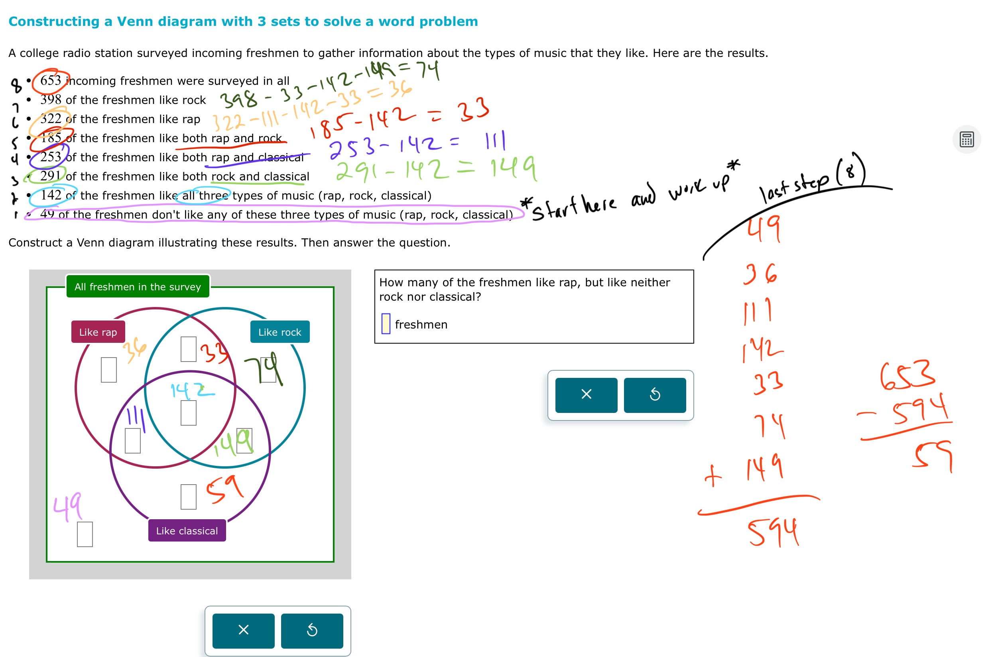

# Constructing a Venn diagram with 3 sets to solve a word problem

# 

## Video:
[https://youtu.be/Qb-WRKRt200
](https://youtu.be/Qb-WRKRt200)[4C641F2E-F510-4E94-8A71-444BB3207B6E](attachments/4C641F2E-F510-4E94-8A71-444BB3207B6E.mp4)
## Worked Examples:

#Sets 