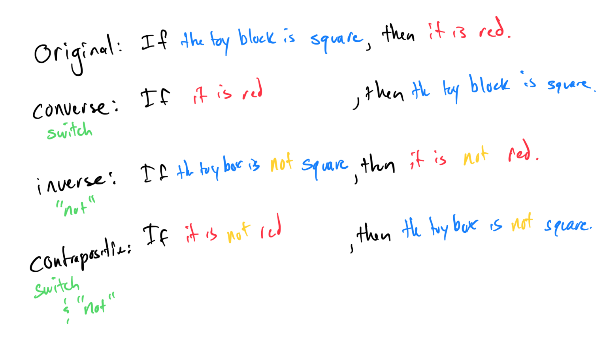

# Writing the converse, inverse, and contrapositive of a conditional…

# Writing the converse, inverse, and contrapositive of a conditional statement and determining their truth value
# 
[48D6DFD6-D80C-46BB-B594-DE6ADC69DE19](attachments/48D6DFD6-D80C-46BB-B594-DE6ADC69DE19.pdf)

Original: If I’m eating McDonald’s, I’m loving it. T
Converse: If I’m loving it, I am eating McDonald’s. F
Inverse: If I am not eating McDonald’s, I am not loving it. F
Contrapositive: If I’m not loving it, I’m not eating McDonald’s. T

#Logic 