# Week 1 - Graphing and Intercepts

Lecture Video
[Week 1 - Graphing and Intercepts](https://youtu.be/LhciagwrRj8)

Intro
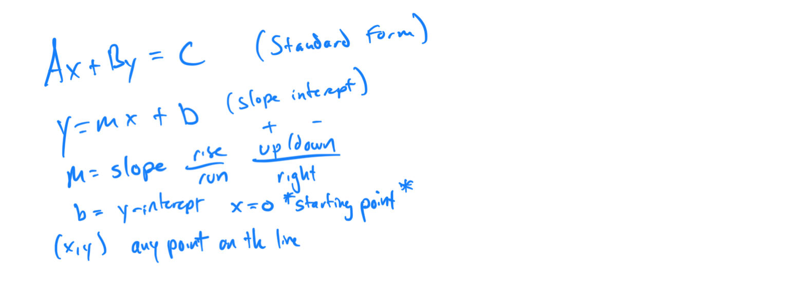

Topic 1: Identifying Solutions to a Linear Equation in Two Variables
1. 2x + y = 5, Pair: (1, 3) 

2. 3x - 2y = 6, Pair: (4, -2) 

Topic 2: Finding a Solution to a Linear Equation in Two Variables
1. y = 2x + 1

2. 4x - y = 3

[C641E457-ACCC-497A-BA4F-8800F8A617D5](attachments/C641E457-ACCC-497A-BA4F-8800F8A617D5.png)

Topic 3: Graphing a Linear Equation of the Form y = mx
1. y = 3x

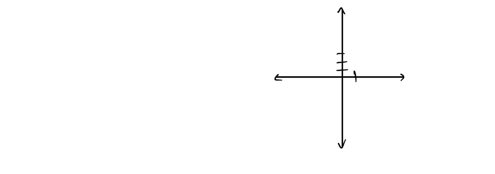

2. y = -2x

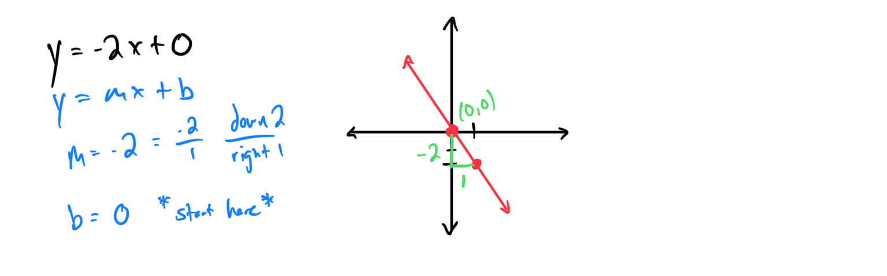

Topic 4: Graphing a Line Given Its Equation in Slope-Intercept Form: Integer Slope
1. y = 2x + 1

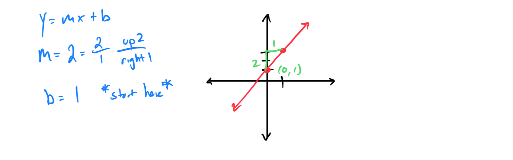

2. y = -3x + 4

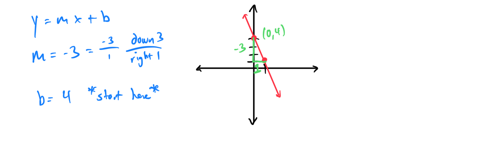

Topic 5: Graphing a Line Given Its Equation in Slope-Intercept Form: Fractional Slope
1. y = (1/2)x - 3

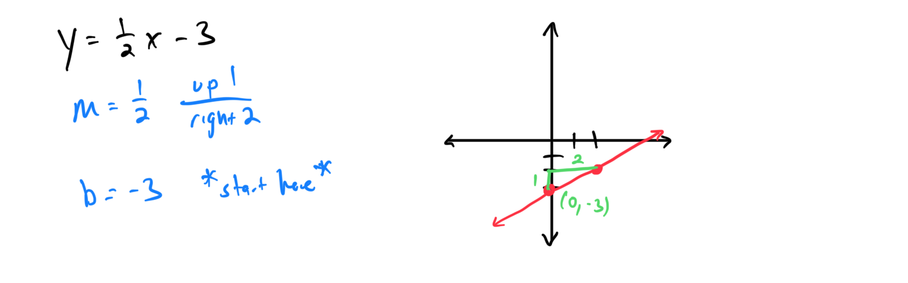

2. y = (-3/4)x + 2

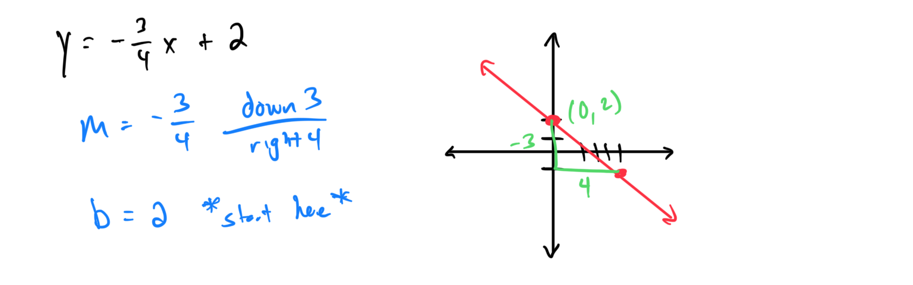

Topic 6: Graphing a Line Given Its Equation in Standard Form
1. 2x + y = 4

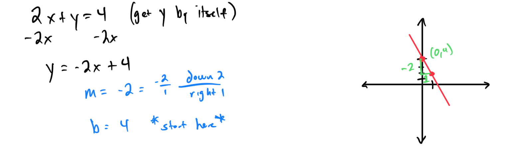

2. 3x - 2y = 6

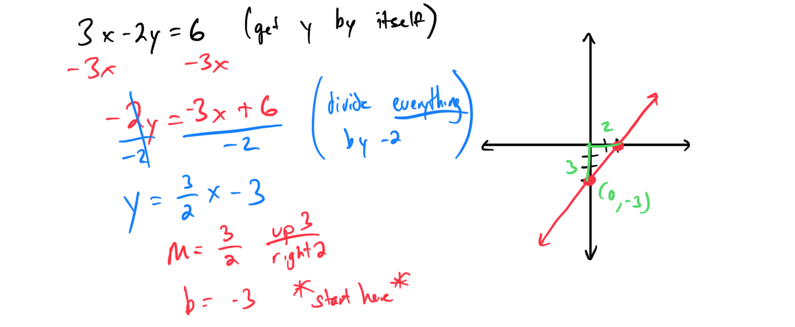

Topic 7: Graphing a Vertical or Horizontal Line
1. x = 3

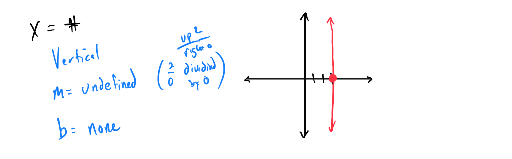

2. y = -2

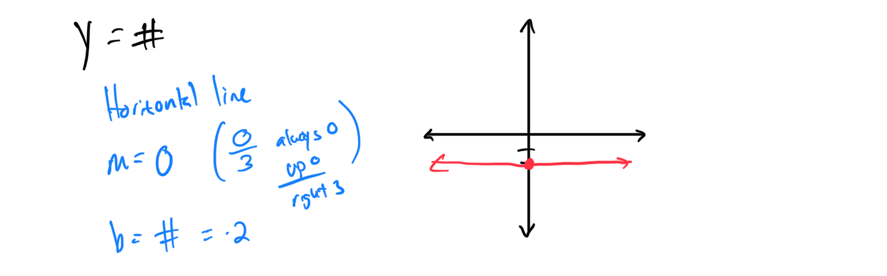

Topic 8: Finding x- and y-Intercepts Given the Graph of a Line on a Grid
1. Line from (4,0) to (0,2)

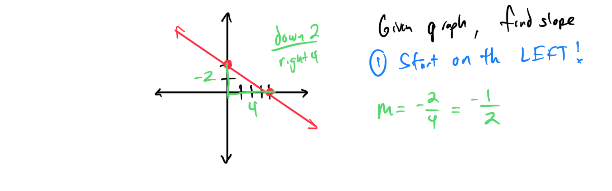

Topic 9: Finding x- and y-Intercepts of a Line Given the Equation: Basic
1. y = 2x + 3

[615A65C3-99BA-44EC-AFDA-A07AEAFF2010](attachments/615A65C3-99BA-44EC-AFDA-A07AEAFF2010.png)

2. y = -x - 1

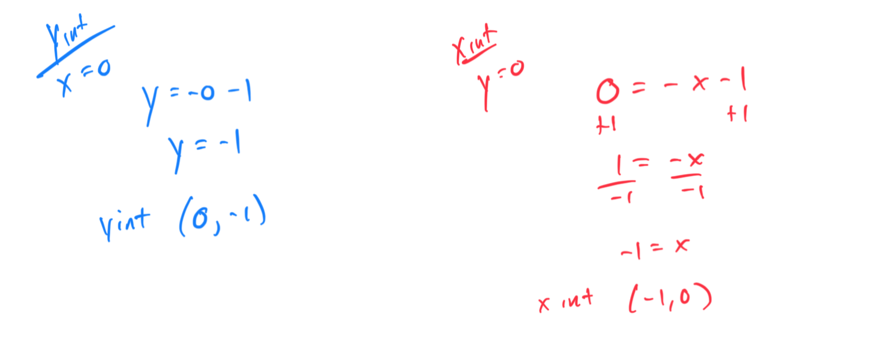

Topic 10: Graphing a Line Given Its x- and y-Intercepts
1. x-intercept: (2,0), y-intercept: (0,4)

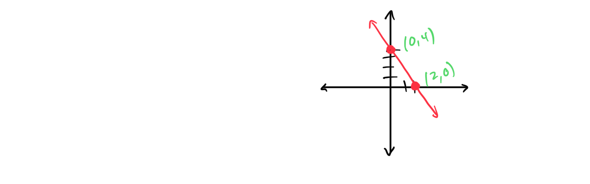

2. x-intercept: (-3,0), y-intercept: (0,1)

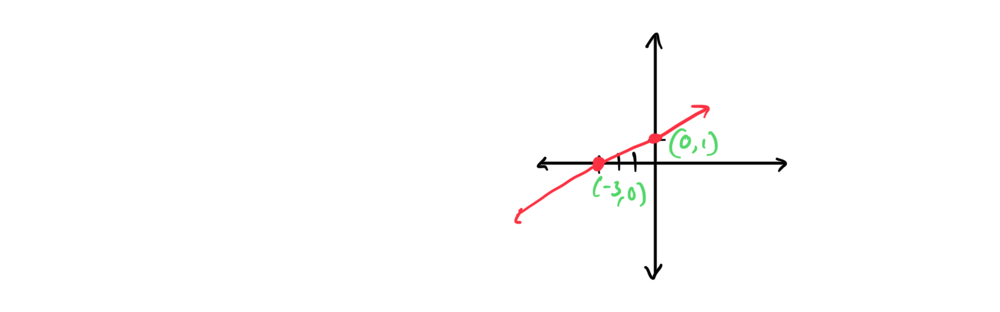

Topic 11: Graphing a Line by First Finding Its x- and y-Intercepts
1. 2x + 3y = 6

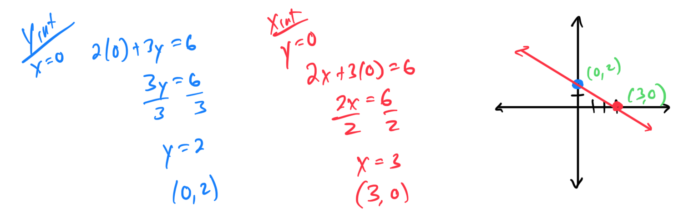

2. x - y = 4

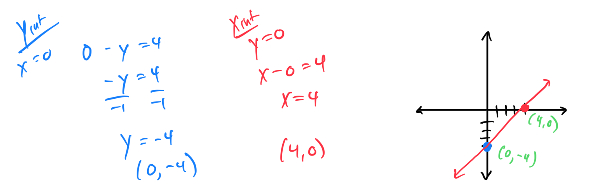

Topic 12: Finding x- and y-Intercepts of a Line Given the Equation: Advanced
1. 4x - 5y = 10

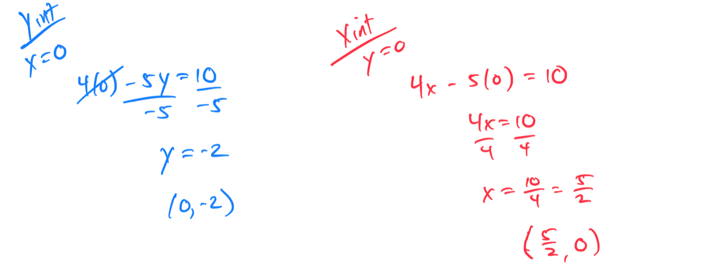

2. -2x + 3y = -9 
[C7D500FB-64AA-4B7B-BBFF-0A9845D2EEE3](attachments/C7D500FB-64AA-4B7B-BBFF-0A9845D2EEE3.png)
