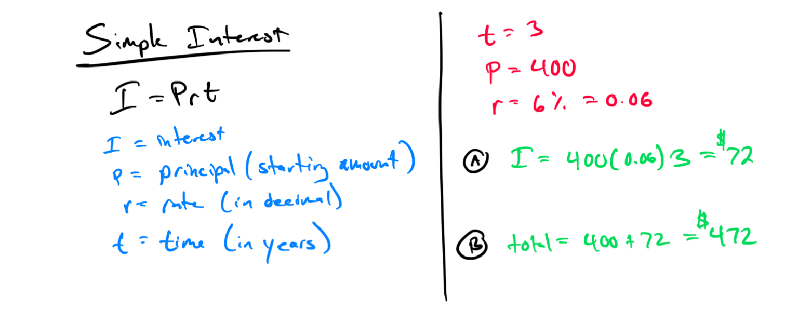
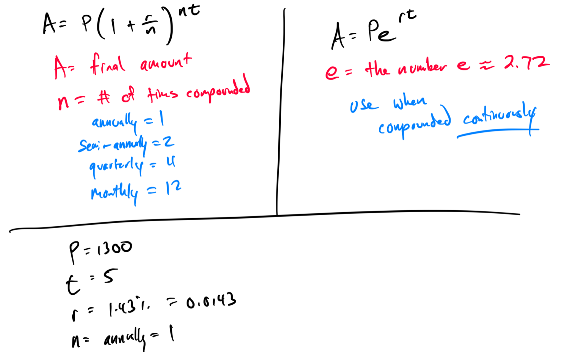
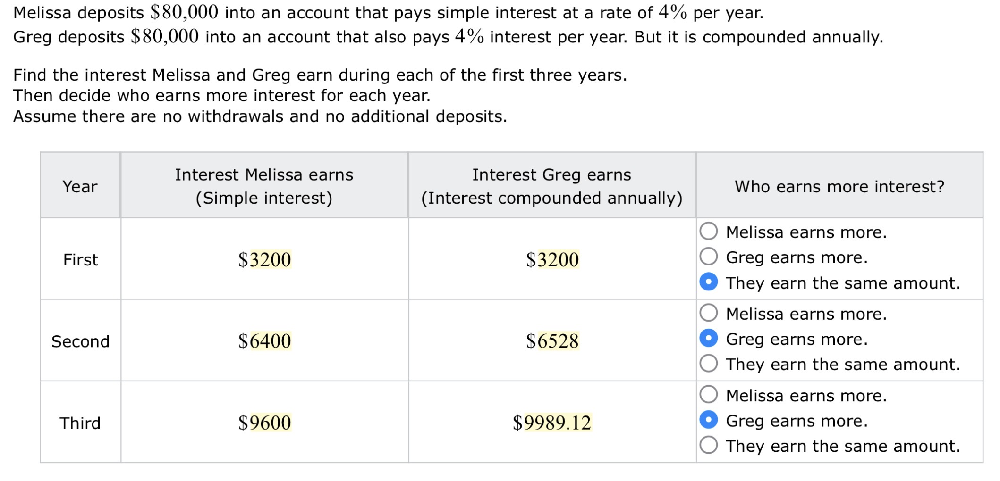

# Week 11 - Simple and Compound Interest

[Video](https://youtu.be/uPYiZJF5esI)
[Simple Interest Calculator
](https://www.calculatorsoup.com/calculators/financial/simple-interest-calculator.php)[Compound Interest Calculator](https://www.calculatorsoup.com/calculators/financial/compound-interest-calculator.php)

### Topic #1: Finding the interest and future value of a simple interest loan or investment  

### Topic #2: Finding the principal, rate, or time of a simple interest loan or investment  

### Topic #3: Computing the interest and repayment amount for a simple interest loan whose term is given in months or days  

### Topic #4: Finding the principal, rate, or time for a simple interest loan whose term is given in months or days  

### Topic #5: Finding the future value and interest for an investment earning compound interest  

### Topic #6: Finding the final amount of a loan or investment earning continuous compound interest  

### Topic #7: Computing the total cost and interest for a loan  

### Topic #8: The U. S. Rule: Making partial note payments before due date  

‎

### Topic #9: Calculating and comparing simple interest and compound interest  

### Topic #10: Finding the initial amount of an investment earning continuous compound interest  
