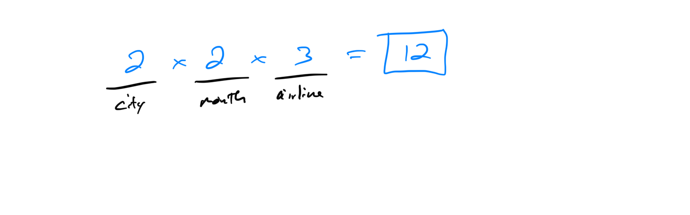
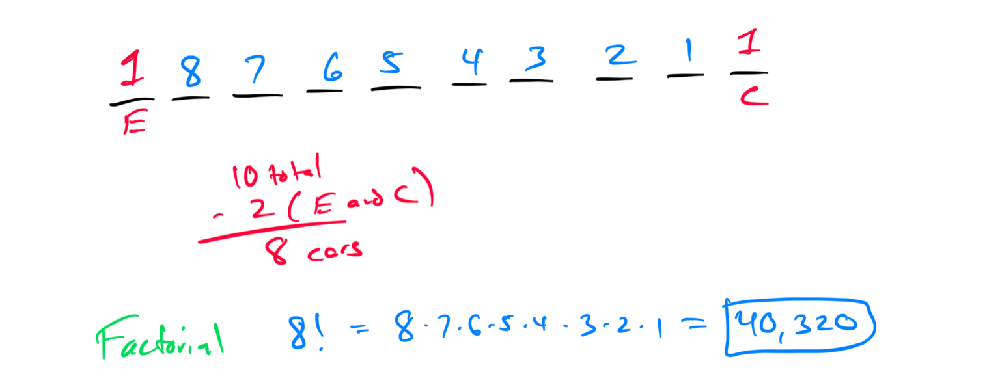
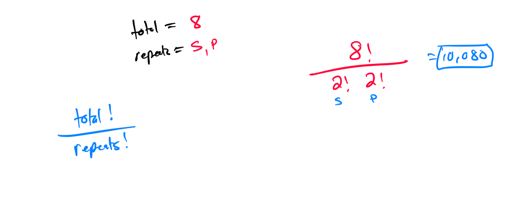

# Week 14 - Counting and Intro to Probability

[Video](https://youtu.be/VAEOD681B4U)

### Topic 1: Interpreting a tree diagram

### 
Topic 2: Introduction to the counting principle
Peaceful Travel Agency offers vacation packages. Each vacation package includes a city, a month, and an airline. The agency has 2 cities, 2 months, and 3 airlines to choose from. How many different vacation packages do they offer?

### Topic 3: Counting principle

### Topic 4: Counting principle with repetition allowed

### Topic 5: Counting principle involving a specified arrangement

A certain train has 10 cars that are being lined up on a track. One of the cars is the engine, and another is the caboose. The engine will be the first car in line. The caboose will be the last car in line. In how many ways can the cars be lined up?

### Topic 6: Counting arrangements of objects that are not all distinct

Find the number of distinct arrangements of the 8 letters in SLIPPERS.
Two of the same letter are considered identical (not distinct).

### 
Topic 7: Introduction to permutations and combinations
Topic 8: Permutations and combinations: Problem type 1
Topic 9: Permutations and combinations: Problem type 2

### Topic 10: Determining a sample space and outcomes for an event: Experiment involving a single selection

### Topic 11: Determining a sample space and outcomes for an event: Experiment involving multiple selections

### Topic 12: Introduction to the probability of an event

### Topic 13: Probability involving one die or choosing from n distinct objects

### Topic 14: Probability involving choosing from objects that are not distinct

### Topic 15: Probability of selecting one card from a standard deck

### Topic 16: Understanding likelihood

### Topic 17: Probabilities of an event and its complement

### 
Topic 18: Outcomes and event probability

### Topic 19: Experimental and theoretical probability

