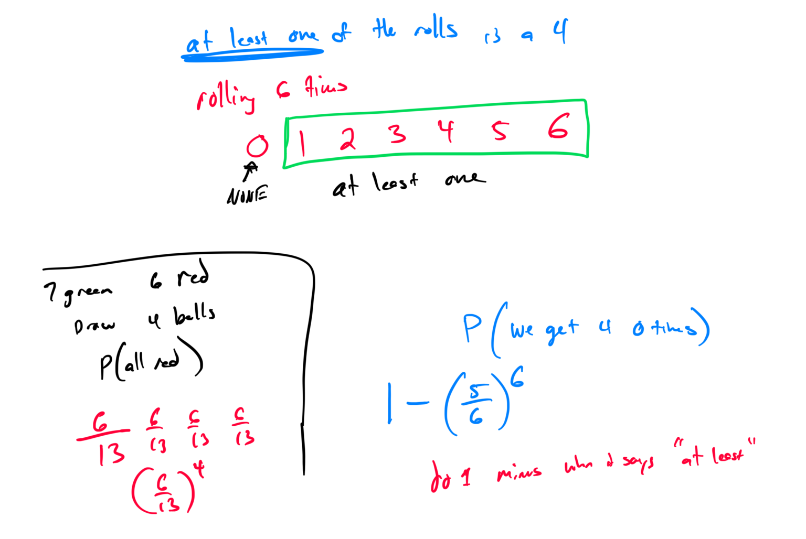

# Week 14 - Probability Rules

[Video](https://youtu.be/9Nh0ZpNwirI)
### 
Topic 1: Identifying independent events given descriptions of experiments

### Topic 2: Probability of independent events: Decimal answers

### Topic 3: Probability of independent events involving a standard deck of cards

### Topic 4: Probabilities of draws with replacement
A fair die is rolled 6 times. What is the probability that a 4 is obtained on at least one of the rolls? Round your answer to three decimal places.

### Topic 5: Determining outcomes for unions, intersections, and complements of events

### Topic 6: Computing conditional probability using a sample space

### Topic 7: Using a Venn diagram to understand the addition rule for probability

### Topic 8: Computing conditional probability using a two-way frequency table

### Topic 9: Computing conditional probability to make an inference using a two-way frequency table

### Topic 10: Tree diagrams for conditional probabilities

### 
Topic 11: Using a Venn diagram to understand the multiplication rule for probability

### 
Topic 12: Probability of intersection or union: Word problems

### Topic 13: Computing probability involving the addition rule using a two-way frequency table

### 
Topic 14: Computing conditional probability using a large two-way frequency table
_

