# Week 2 - Systems of Linear Equations

## Video - Part 1
[Video](https://youtu.be/M-yI75UFTWc)

## **Video - Part 2**
[Video](https://youtu.be/8KxPFoTkWtM)
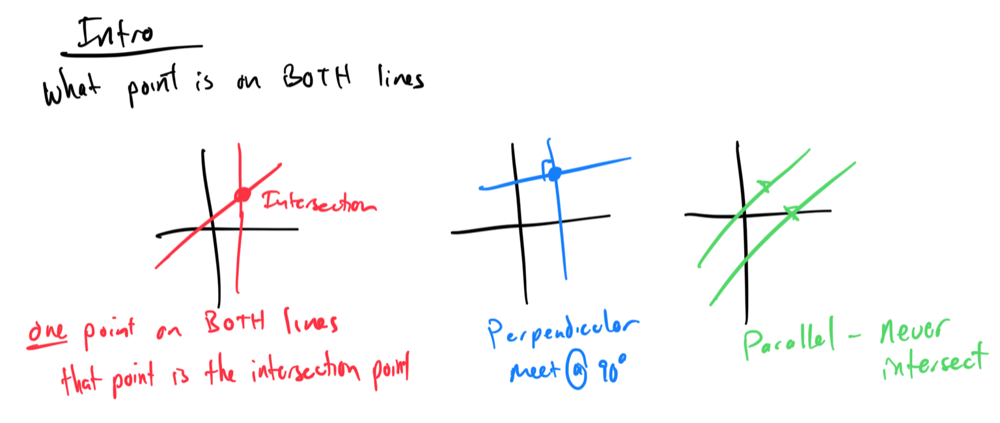
## 

**Topic 1: Identifying solutions to a system of linear equations**
1. Determine if (2, 3) is a solution to the system: y = x + 1 and y = -2x + 7: **Yes, (2, 3) satisfies both equations**.

[C844EE41-D85D-4DF5-8935-77C7E2048DF2](attachments/C844EE41-D85D-4DF5-8935-77C7E2048DF2.png)

1. Check if (2, 7) satisfies the system: y = 3x + 1 and 2x + y = 6:

## **Topic 2: Identifying the solution of systems of linear equations from graphs**
1. Find the solution to the system of equations from their graphs: y = 2x - 1 and y = -x + 5 intersecting at (2, 3): **Solution: (2, 3)**.

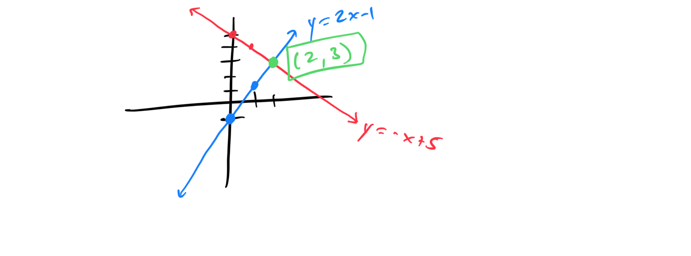

## **Topic 3: Graphically solving a system of linear equations both of the form y=mx+b**
1. Solve the system by graphing: y = 2x + 1 and y = -x + 4: **Solution: (1, 3)**.

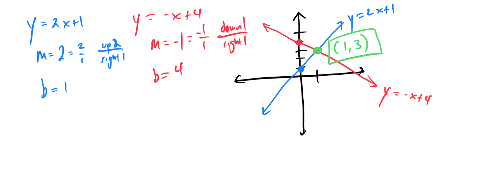

1. Graph the system to find the solution: y = (1/2)x - 1 and y = -2x + 5: **Solution: (2, 0)**.
## **Topic 4: Graphically solving a system of linear equations**
1. Solve the system by graphing: 2x + y = 4 and x - y = 1

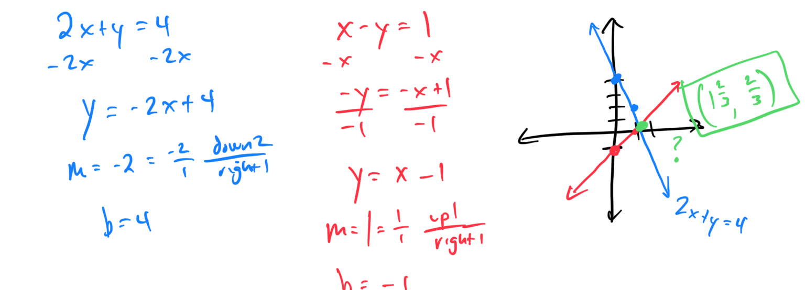

1. Find the solution by graphing: 3x - 2y = 6 and y = x - 1: **Solution: (0, -1)**.
## **Topic 5: Solving a system of linear equations using substitution**
1. Solve the system using substitution: y = 2x + 4 and x + y = 7: **Solution: (1, 6)**.

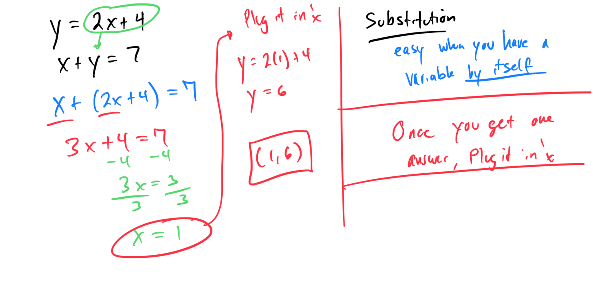

1. Use substitution to solve: x = 4 - y and 2x + y = 5

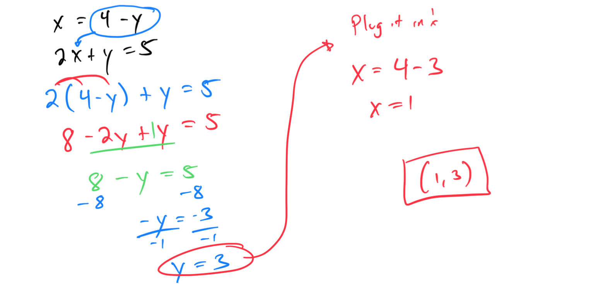

## **Topic 6: Solving a system of linear equations using elimination with addition**
1. Solve the system using elimination: x + y = 5 and x - y = 1: **Solution: (3, 2)**.

[F395E562-1418-4238-8A9C-63CE86B105B7](attachments/F395E562-1418-4238-8A9C-63CE86B105B7.png)

1. Use elimination to solve: 2x + 3y = 12 and 2x - 3y = 0: **Solution: (3, 2)**.

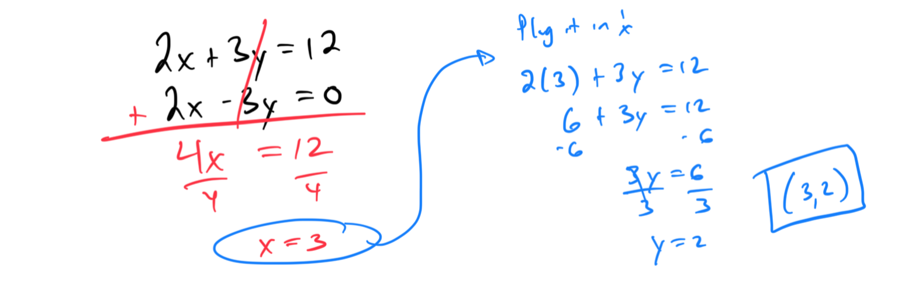

## **Topic 7: Solving a system of linear equations using elimination with multiplication and addition**
1. Solve the system using elimination: 2x + 3y = 11 and 3x + 5y = 18: **Solution: (1, 3)**.

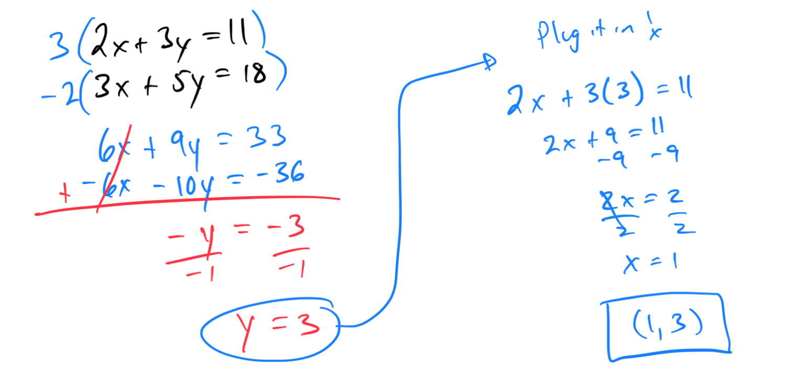

1. Use elimination to solve: 4x - 2y = 10 and 3x + 4y = 2

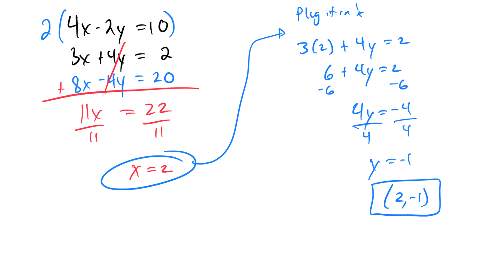

1. Use elimination to solve: -9x - 8y = -9 and -2x + 3y = -2

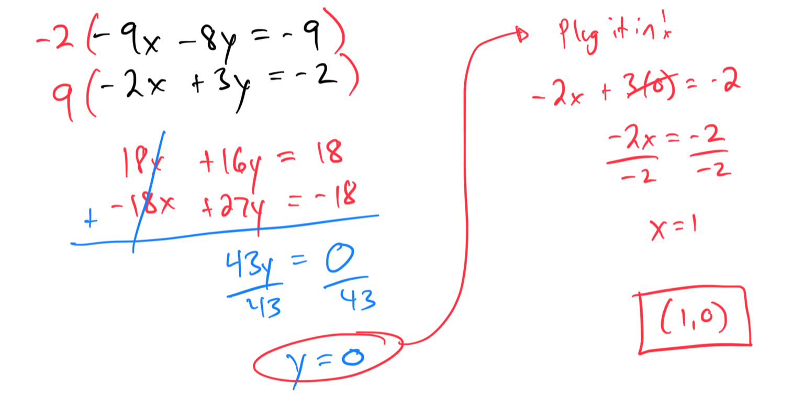

## **Topic 8: Solving systems of linear equations with 0, 1, or infinitely many solutions**
1. Determine the number of solutions for the system: 2x + y = 3 and 4x + 2y = 6: **Infinitely many solutions**.

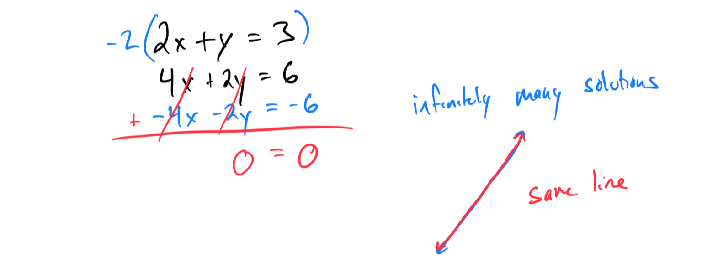

1. Find the number of solutions for the system: x - y = 4 and 3x - 3y = 6

[86A4B14D-955F-4406-B27F-C590480E6002](attachments/86A4B14D-955F-4406-B27F-C590480E6002.png)

## **Topic 9: Solving a word problem involving a sum and another basic relationship using a system of linear equations**
1. The sum of two numbers is 15, and their difference is 3. Find the numbers using a system of equations: **Numbers: 9 and 6**.

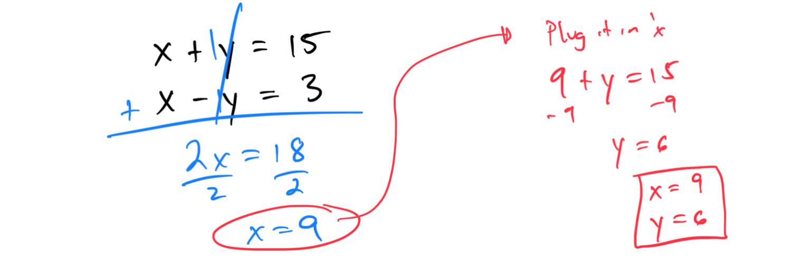

1. A store sells 2 pens and 3 notebooks for $13, and 1 pen and 2 notebooks for $8. Find the cost of each: **Pen: $2, Notebook: $3**.

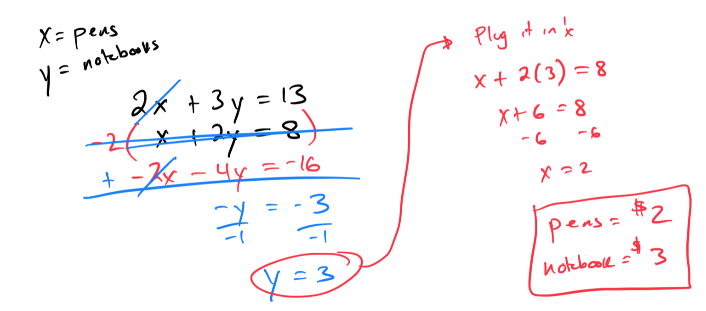

## **Topic 10: Writing and solving a system of two linear equations given a table of values**

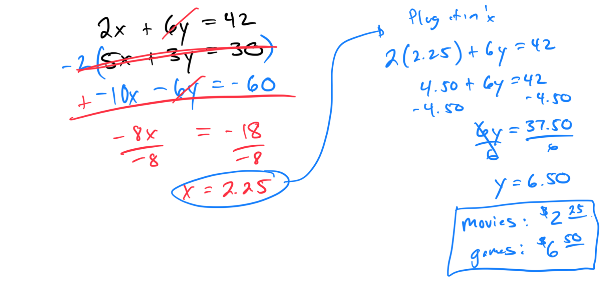

[01D1FE5F-AC57-4695-84E0-41D199B27C94](attachments/01D1FE5F-AC57-4695-84E0-41D199B27C94.png)

## **Topic 11: Writing a system of linear equations given its graph**
1. Write the system of equations for two lines

[8AA9BE88-AD98-4C27-AB23-FA726E46A166](attachments/8AA9BE88-AD98-4C27-AB23-FA726E46A166.png)

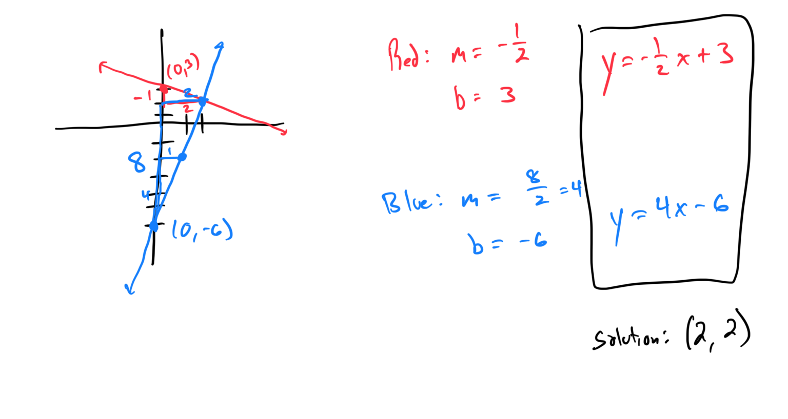