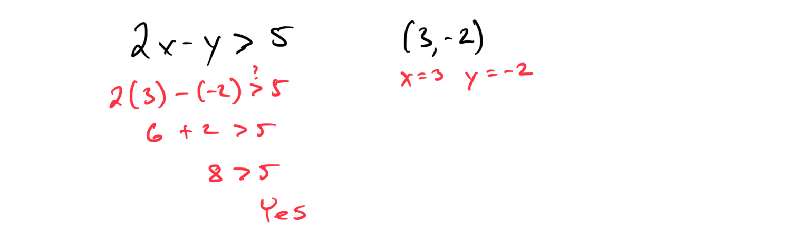
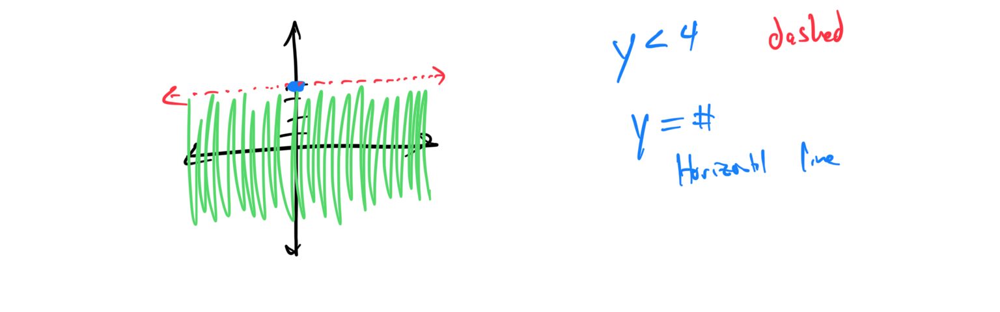
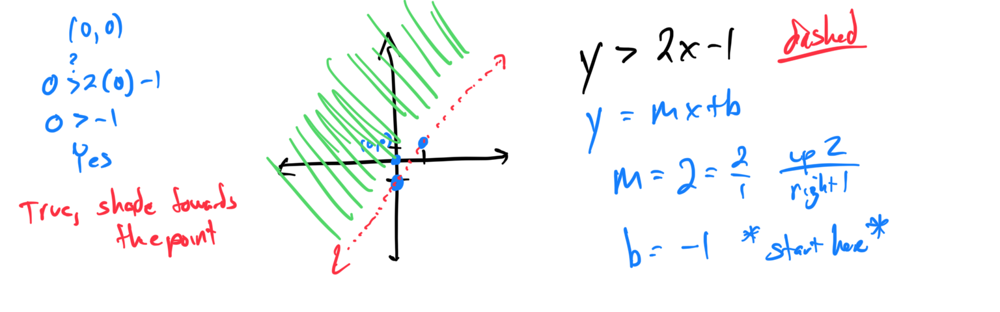
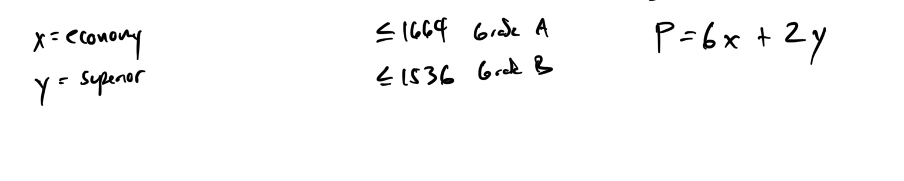

# Week 3 - Graphing Linear Inequalities

[Video - Part 1](https://youtu.be/-A_vNYnrups)

[Video - Part 2
](https://youtu.be/fZlkW-F9dJU)

Topic 1: Identifying solutions to a linear inequality in two variables

**Problem 1:** Determine whether the point (3, -2) is a solution to the inequality 2x - y > 5. Show your work by substituting the values and checking the inequality. 

**Problem 2:** Check if the ordered pair (-1, 4) satisfies the inequality x + 3y ≤ 10. Provide the substitution steps and explain your conclusion. 
[5D56540E-33B9-4E80-A0A1-8B468B78BE91](attachments/5D56540E-33B9-4E80-A0A1-8B468B78BE91.png)

Topic 2: Graphing a linear inequality in the plane: Vertical or horizontal line

**Problem 1:** Graph the inequality x ≥ -3 on the coordinate plane. Label the boundary line and shade the appropriate region. 
[B6C4FC3A-D083-4366-9373-CF9D7BF207C9](attachments/B6C4FC3A-D083-4366-9373-CF9D7BF207C9.png)

**Problem 2:** Sketch the graph of y < 4. Indicate whether the boundary line is solid or dashed, and shade the solution set. 

Topic 3: Graphing a linear inequality in the plane: Slope-intercept form

**Problem 1:** Graph the inequality y > 2x - 1. Identify the slope and y-intercept, draw the boundary line, and shade the correct half-plane. 

**Problem 2:** Plot the solution to y ≤ - (1/2)x + 3. Show the boundary line with appropriate style (solid or dashed) and test a point to verify the shading. 
[64BA5EA2-D772-4D5D-BED9-B7DE628C7BFA](attachments/64BA5EA2-D772-4D5D-BED9-B7DE628C7BFA.png)

Topic 4: Graphing a linear inequality in the plane: Standard form

**Problem 1:** Graph 3x + 2y ≥ 6. Convert to slope-intercept form if needed, draw the boundary, and shade the region. 

**Problem 2:** Sketch the inequality 4x - 5y < 20. Find the intercepts, plot the line, and use a test point to determine the shading. 
[96E58CB3-BC15-43D1-9968-E5D8C5897DA3](attachments/96E58CB3-BC15-43D1-9968-E5D8C5897DA3.png)

Topic 5: Graphing a system of two linear inequalities: Basic

**Problem 1:** Graph the system: y > x - 2 and y ≤ 3. Identify the overlapping shaded region as the solution set. 
[155BBF37-6892-49C0-B97C-5754BF62845E](attachments/155BBF37-6892-49C0-B97C-5754BF62845E.png)

**Problem 2:** Plot the solution to x ≥ 0 and y < -x + 4. Shade the feasible region and label any boundary lines. 

Topic 6: Graphing a system of two linear inequalities: Advanced

**Problem 1:** Graph the system: 2x + y ≥ 4 and x - 3y < -6. Find the intersection point of the boundaries and shade the solution area. 

**Problem 2:** Sketch the inequalities: -x + 2y ≤ 8 and 3x + y > 9. Test multiple points to confirm the overlapping region. 

Topic 7: Graphing a system of three linear inequalities

**Problem 1:** Graph the system: y ≥ x, y ≤ -x + 5, and x ≥ 0. Identify the bounded region and label the vertices. 

**Problem 2:** Plot the solution to 2x + y > 4, x - y ≤ 3, and y ≥ 1. Shade the feasible area and find any corner points. 
[E8B97749-1F42-48F8-8777-A2F7571D77FB](attachments/E8B97749-1F42-48F8-8777-A2F7571D77FB.png)

Topic 8: Writing a multi-step inequality for a real-world situation

**Problem 1:** A small cargo plane currently has 155 pounds of cargo aboard. In addition, *n* boxes weighing *50* pounds each will be brought aboard. Suppose that the total weight of the cargo on board must be at most *p* pounds. Using the values and variables given, write an inequality describing this

**Problem 2:** At Teresa's auto shop, it takes her 9 minutes to do an oil change and 15 minutes to do a tire change. Let *x* be the number of oil changes she does. Let *y* be the number of tire changes she does.  Using the values and variables given, write an inequality describing how many oil changes and tire changes Teresa can do in less than an hour (60 minutes).

Topic 9: Writing a linear inequality in two variables given a table of values

Topic 10: Solving a word problem using a system of linear inequalities: Problem type 1

**Problem 1:** Dante does a weekly exercise program consisting of cardiovascular work and weight training. Each week, he exercises for at least 12 hours. He spends at most 10 hours doing cardiovascular work. He spends at most 7 hours on weight training. Let x denote the time (in hours) that Dante spends doing cardiovascular work. Let y denote the time (in hours) that he spends on weight training. Shade the region corresponding to all values of x and y that satisfy these requirements.

[42CF07EB-2B63-48C4-B33F-862D4B254B1F](attachments/42CF07EB-2B63-48C4-B33F-862D4B254B1F.png)

Topic 11: Linear programming

**Problem 1:** Maximize P = 3x + 4y subject to x + y ≤ 5, 2x + y ≤ 6, x ≥ 0, y ≥ 0. Graph the feasible region and find the optimal value.

**Problem 2:** Minimize C = 2x + 5y with constraints x + 2y ≥ 4, 3x + y ≥ 6, x ≥ 0, y ≥ 0. Identify vertices and evaluate the objective function.

Topic 12: Solving a word problem using linear programming

**Problem 1:**

**Problem 2:**

