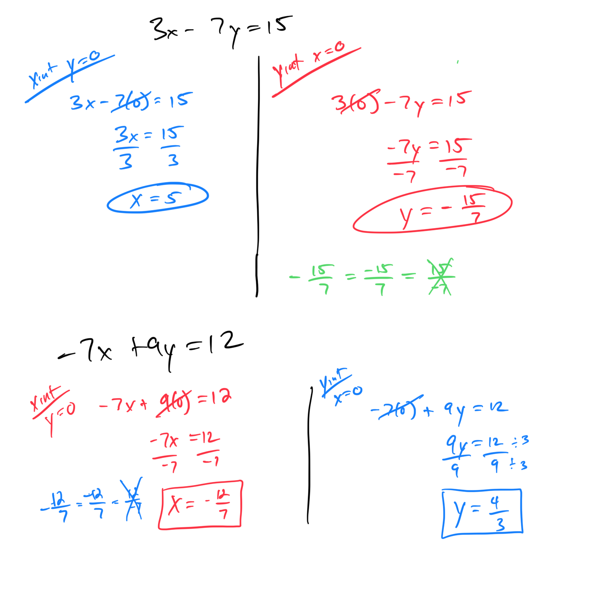
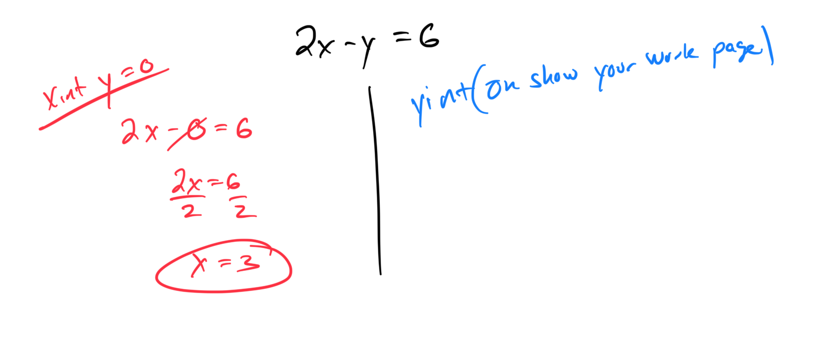
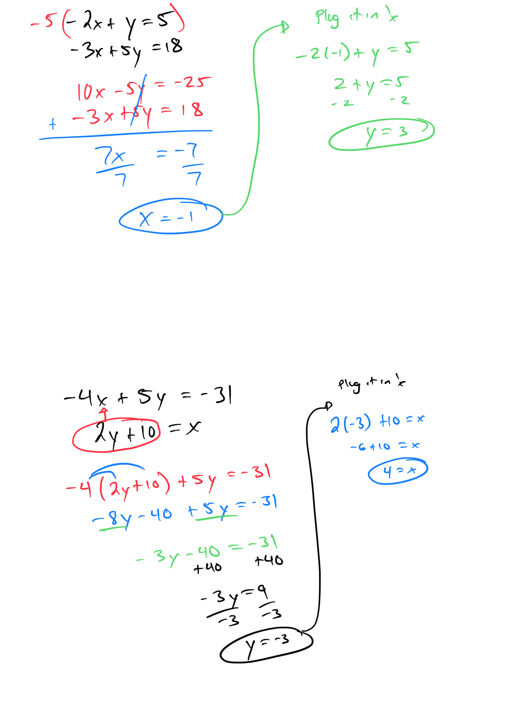
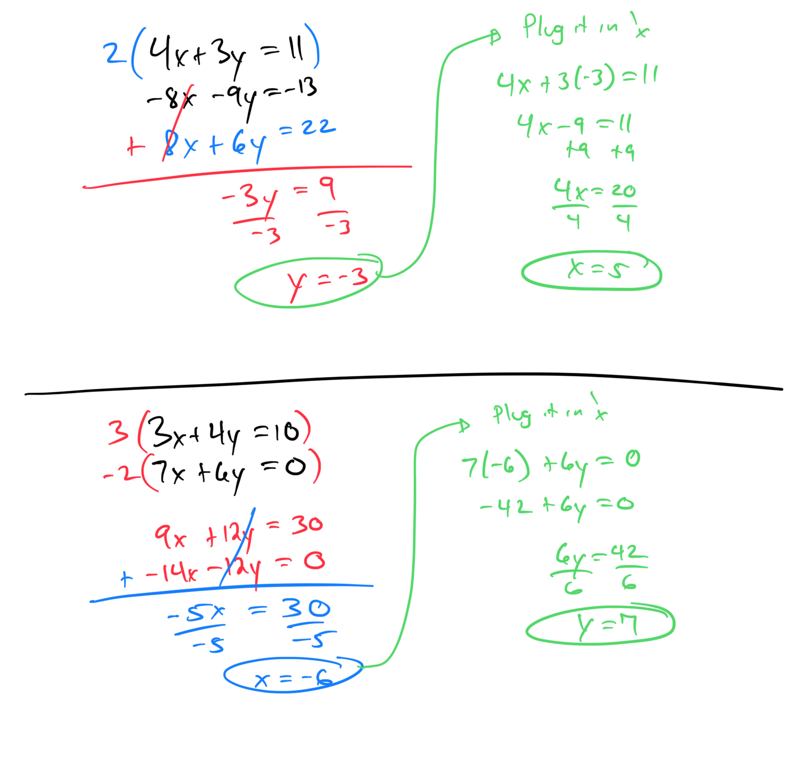
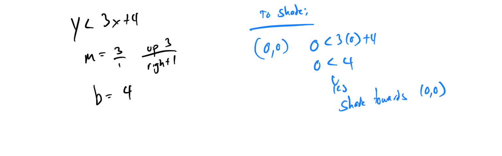
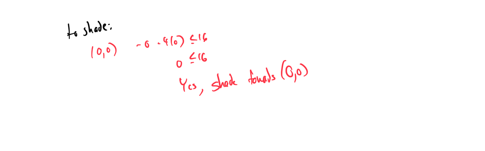
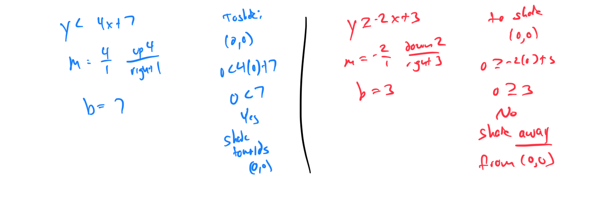

# Week 4 - Graphing Test Review

[Video](https://youtu.be/WIbG4kyC4Zk)

###  Question 2: Graphing a line given its equation in slope-intercept form: Integer slope

### Question 3: Graphing a line given its equation in slope-intercept form: Fractional slope

### 
Question 4: Graphing a line given its equation in standard form
More work show on Test Work Page below

### 
Question 5: Graphing a vertical or horizontal line

More work show on Test Work Page below.

### 
Question 6: Finding x- and y-intercepts given the graph of a line on a grid

### 
Question 7:

### 
### Question 8: Finding x- and y-intercepts of a line given the equation: Advanced

### Question 9: Solving a system of linear equations using substitution

### 
Question 10: Solving a system of linear equations using elimination with multiplication and addition

### 
Question 11:Graphing a linear inequality in the plane: Slope-intercept form

### 
Question 12: Graphing a linear inequality in the plane: Standard form
More work below on Test Work Page.

### 
Question 13: Graphing a system of two linear inequalities: Basic
More work on Test Work Page below.

### Topic 13: **Solving a word problem using a system of linear inequalities: Problem type 1**

## **Test Work Page Example:**

