# Week 5 - Sets

[Video](https://youtu.be/wp8LKb0rk7Y)

Topic 1: Identifying elements of sets for a real world situation

Topic 2: Writing sets of numbers using descriptive and roster forms
Problem 1: Write the set of even numbers between 1 and 10 in both descriptive and roster forms.
Problem 2: Express the set of odd natural numbers less than 8 in descriptive form and roster form.

[7E292208-3CBA-4D1D-BEE4-1CAC72C05E3B](attachments/7E292208-3CBA-4D1D-BEE4-1CAC72C05E3B.png)

Topic 3: Writing sets of natural numbers using set-builder and roster forms
Problem 1: Write the set of natural numbers less than 6 using set-builder notation and roster form.

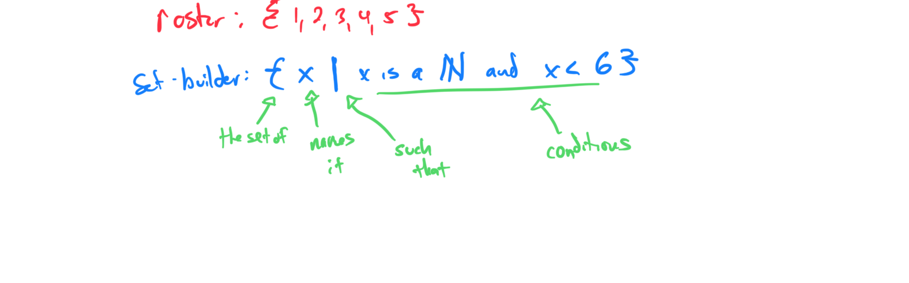

Problem 2: Express the set of natural numbers greater than 3 but less than 10 in set-builder and roster forms.

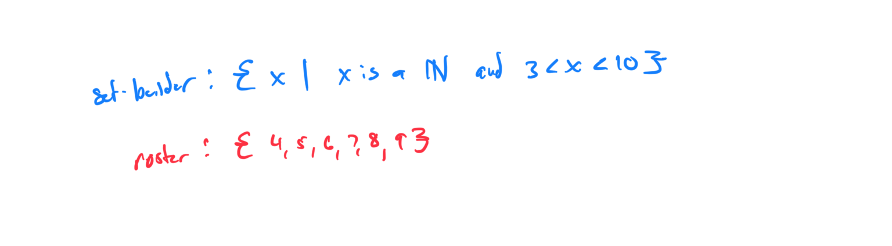

Topic 4: Writing sets of integers using set-builder and roster forms
Problem 1: Roster form: {15, 16, 17}.  Find set-builder form.

Problem 2: Set-builder form: {x | x is a natural number and x >5}.  Find roster form.

Topic 5: Identifying well defined sets

|                                                                                                                     | Yes                                                                                                                 | No                                                                                                                  |
|---------------------------------------------------------------------------------------------------------------------|---------------------------------------------------------------------------------------------------------------------|---------------------------------------------------------------------------------------------------------------------|
| The set containing the sitcom most watched by men and the sitcom least watched by women in the Friday night line-up | X                                                                                                                   |                                                                                                                     |
| The set containing only the show in the Friday night line-up with the best dressed actors                           |                                                                                                                     | X                                                                                                                   |
| The set of the two most watched shows overall in the Friday night line-up                                           | X                                                                                                                   |                                                                                                                     |
| The set containing only the show in the Friday night line-up with the best cast                                     |                                                                                                                     | X                                                                                                                   |
| The set of the first three shows to air according to the Friday night schedule                                      | X                                                                                                                   |                                                                                                                     |

Topic 6: Membership and cardinality of sets

[4D7E84B5-0B89-4937-8E78-1DDA786BF5D5](attachments/4D7E84B5-0B89-4937-8E78-1DDA786BF5D5.png)

Topic 7: Identifying infinite sets and determining cardinalities of finite sets

[1C47D927-7354-48B6-A5AB-83EBFB3F0B84](attachments/1C47D927-7354-48B6-A5AB-83EBFB3F0B84.png)

Topic 8: Identifying equivalent and equal sets

[18AF2A8E-3BA7-4D28-9555-57603560269A](attachments/18AF2A8E-3BA7-4D28-9555-57603560269A.png)

Topic 9: Identifying equivalent and equal sets for a real-world situation

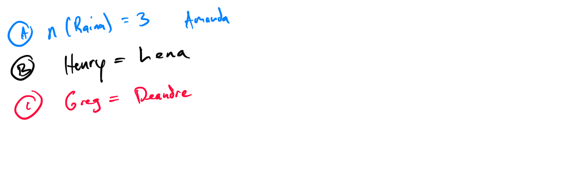

Topic 10: Identifying true statements involving subsets and proper subsets

Topic 11: Writing subsets
Problem 1: List all subsets of the set {x, y}. Include the empty set and the set itself.

Problem 2: Write all subsets of the set {1, 2, 3}. Ensure all possible subsets are included.

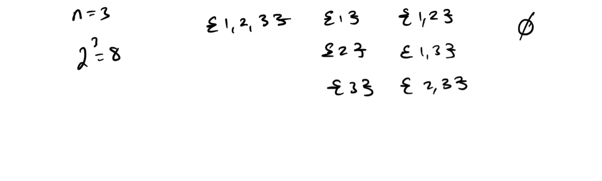

Topic 12: Writing subsets for a real-world situation
Problem 1: A menu offers toppings {cheese, pepperoni}. List all possible subsets of toppings for a pizza order.
Problem 2: For a set of activities {swim, run, bike}, write all subsets representing possible combinations of activities.

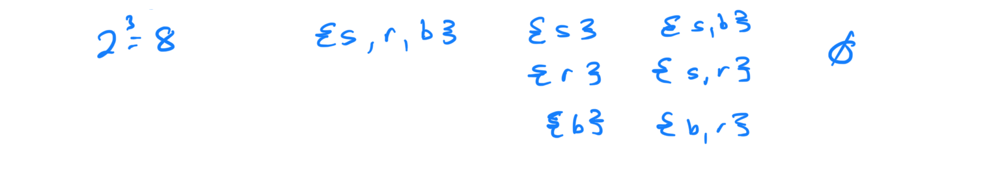

Topic 13: Determining the total number of subsets of a set
Problem 1: Find the total number of subsets of the set {a, b, c, d, e, f}. Use the formula 2^n and verify by listing.

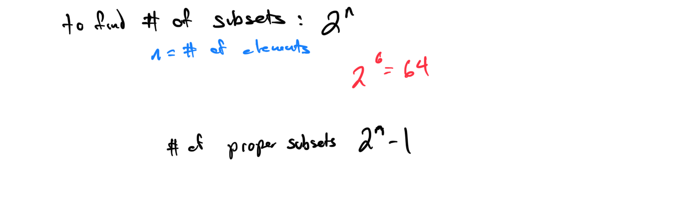

Problem 2: Calculate the number of subsets of the set {1, 2, 3, 4, 5, 6, 7}. Confirm using the formula 2^n.

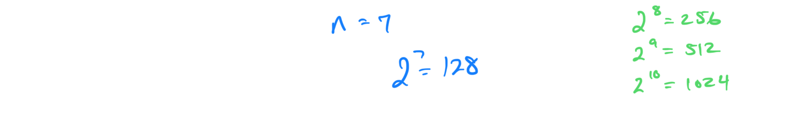

Topic 14: Determining the number of subsets for a real-world situation
Problem 1: A club with 8 members forms committees. How many possible committees (subsets) can be formed? Use the subset formula.

Problem 2: A store offers 4 flavors {chocolate, vanilla, strawberry, mint}. How many subsets of flavors are possible for an ice cream order?

Topic 15: Finding sets and complements of sets
Problem 1: Given the universal set U = {1, 2, 3, 4, 5} and A = {2, 4}, find the complement of A. List the elements.

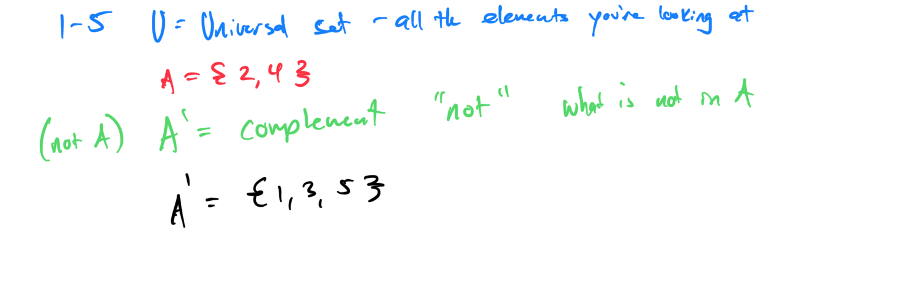

Problem 2: For U = {a, b, c, d} and B = {a, c}, compute the complement of B in U. 

Topic 16: Finding sets and complements of sets for a real-world situation
Problem 1: In a class of students U = {Alice, Bob, Carol, Dave}, let A = {Alice, Carol} be students who passed a test. Find the complement of A (students who did not pass).

Problem 2: For a set of fruits U = {apple, banana, orange, pear} and B = {apple, pear} as fruits in stock, find the complement of B (fruits not in stock).

Topic 17: Union and intersection of finite sets
Problem 1: Given A = {1, 2, 3} and B = {2, 4, 6}, find A ∪ B and A ∩ B. List the elements of each.

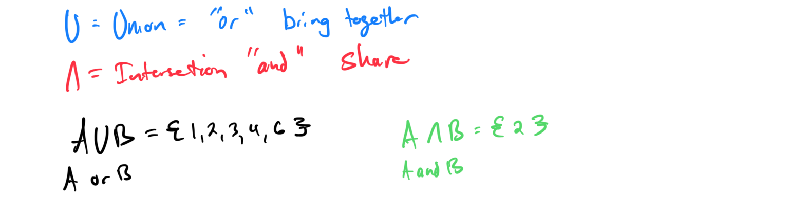

Problem 2: For U = {A, B ,C D, E, F}, C = {A, B, C} and D = {B, C, D}, compute C’ ∪ D.
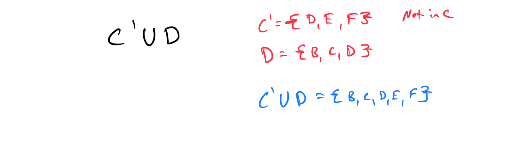

Topic 18: Unions, intersections, and complements involving 2 sets
Problem 1: Given U = {1, 2, 3, 4, 5}, A = {1, 3, 5}, and B = {2, 3, 4}, find (A ∩ B)’.

[CC30F218-6C2C-4E73-B721-1F7556E6629F](attachments/CC30F218-6C2C-4E73-B721-1F7556E6629F.png)

Problem 2: For U = {a, b, c, d, e}, C = {a, c, e}, and D = {b, c, d}, compute C ∪ D, C ∩ D, and the complement of D.

Topic 19: Unions and intersections involving the empty set or universal set
Problem 1: Given U = {1, 2, 3} and A = {1, 2}, find A ∪ ∅.

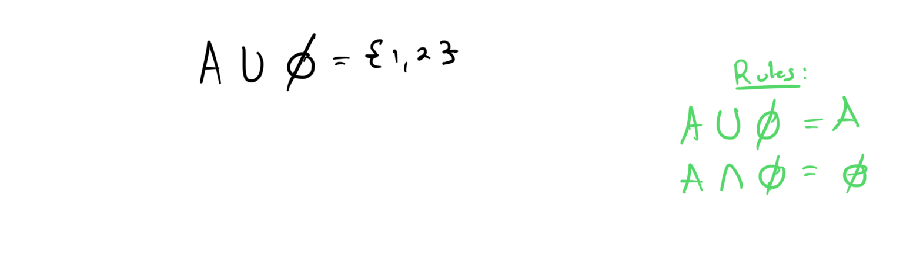

Problem 2: For U = {a, b, c} and B = {a}, compute  B ∩ U.

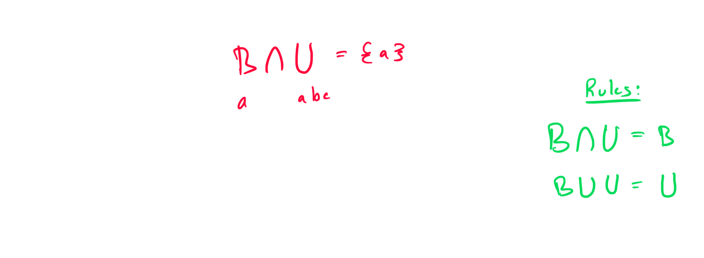

Topic 20: Writing sets for a real-world situation using descriptive and roster forms

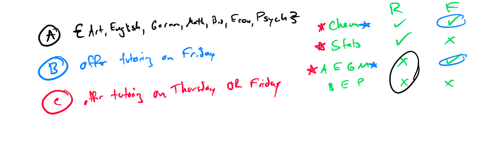
