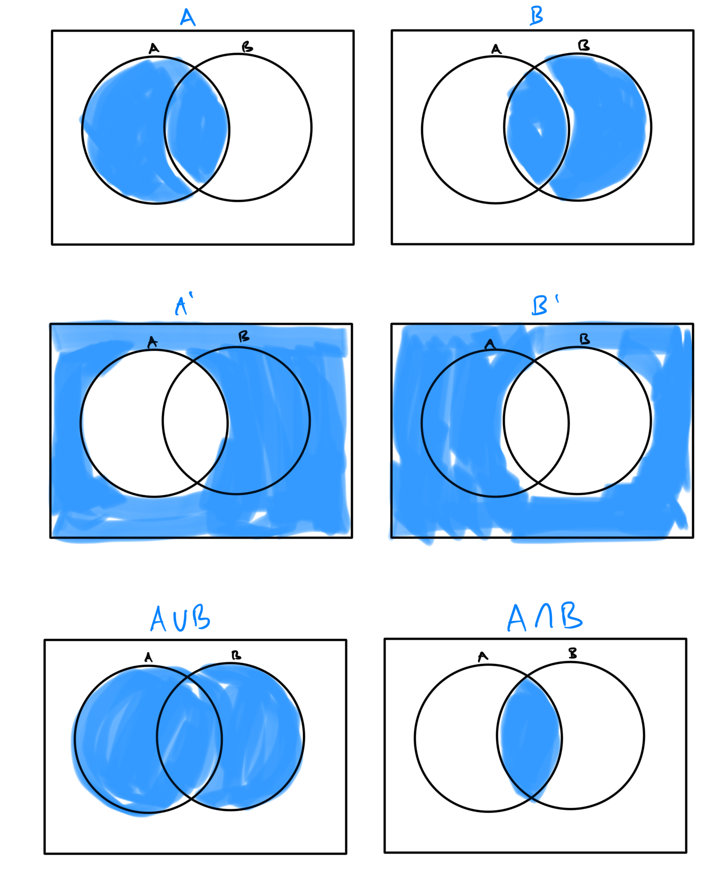

# Week 6 - Venn Diagrams

[Video - Part 1](https://youtu.be/l5vl-etQoSs)

[Video - Part 2](https://youtu.be/CI-StI2EcPM)

Topic 1: Interpreting a Venn diagram with 2 sets for a real-world situation

Topic 2: Interpreting a Venn diagram with 3 sets for a real-world situation

Topic 3: Interpreting Venn diagram cardinalities with 2 sets for a real-world situation

Topic 4: Constructing a Venn diagram with 2 sets

Topic 5: Constructing a Venn diagram with 3 sets

Topic 6: Introduction to shading a Venn diagram with 2 sets

Topic 7: Shading a Venn diagram with 2 sets: Unions, intersections, and complements

Topic 8: Shading Venn diagrams to determine if sets are equal

Topic 9: Venn diagram with 2 sets: Unions, intersections, and complements

Topic 10: Introduction to shading a Venn diagram with 3 sets

Topic 11: Constructing a Venn diagram with 2 sets to solve a word problem

Topic 12: Interpreting Venn diagram cardinalities with 3 sets for a real-world situation

Topic 13: Constructing a Venn diagram with 3 sets to solve a word problem

Topic 14: Venn diagram with 2 sets: Unions, intersections, and complements for a real-world situation

