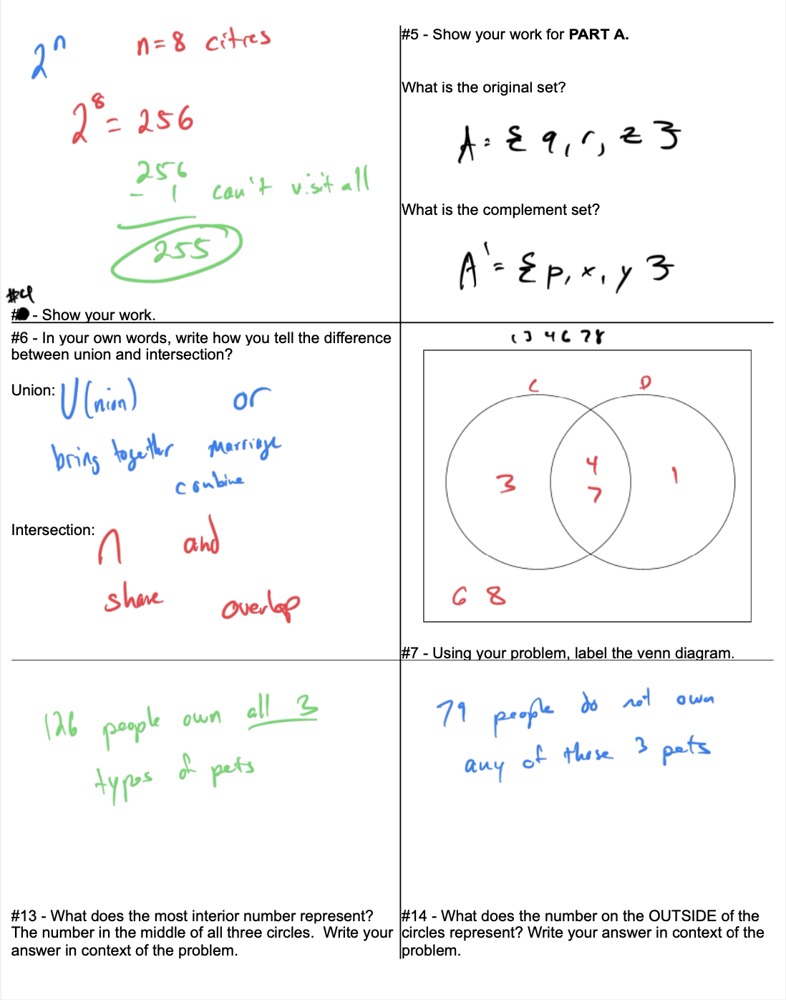

# Week 7 - Sets Test Review

[Video](https://youtu.be/bpwCDjrVJvs)
Question 2: Writing sets for a real-world situation using descriptive and roster forms  

Question 3: Identifying infinite sets and determining cardinalities of finite sets  

Question 4: Determining the number of subsets for a real-world situation  

Question 5: Finding sets and complements of sets  

Question 6: Union and intersection of finite sets  

Question 7: Unions, intersections, and complements involving 2 sets 
 

Question 8: Unions and intersections involving the empty set or universal set  

I didn’t do this on the video, but in ALEKS you can’t write U for Universal.  You need to write it in roster form so (b) would be {p a, r, x, y, z}

Question 9: Interpreting a Venn diagram with 3 sets for a real-world situation  

Question 10: Interpreting Venn diagram cardinalities with 2 sets for a real-world situation  

I can’t add. It’s 119+68+77=264

Question 11: Constructing a Venn diagram with 2 sets  

Question 12: Constructing a Venn diagram with 2 sets to solve a word problem 
 

Question 13: Interpreting Venn diagram cardinalities with 3 sets for a real-world situation  

Question 14: Constructing a Venn diagram with 3 sets to solve a word problem

