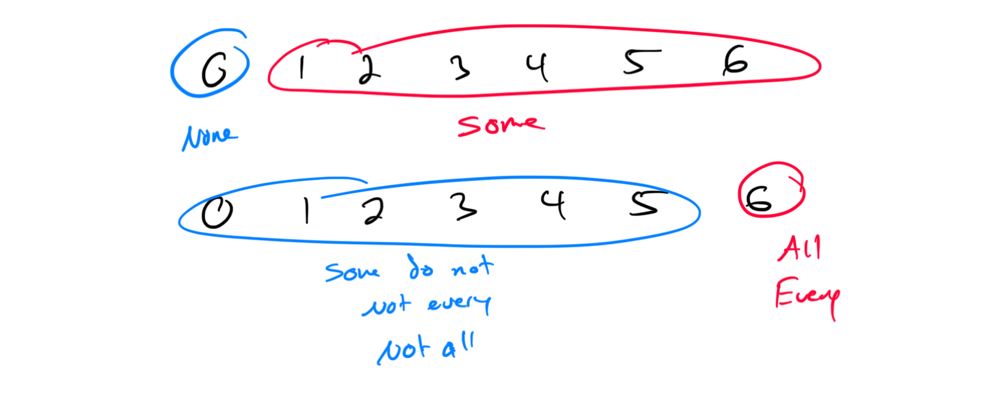
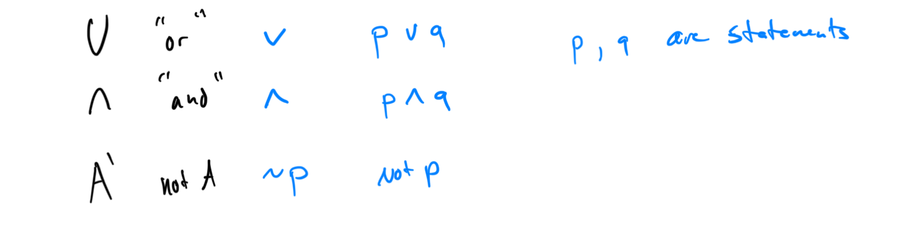
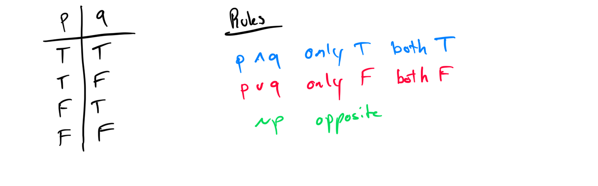

# Week 8 - Logic

[Video](https://youtu.be/QG3xc_ximwo)

Topic 1: Identifying statements

Topic 2: Identifying simple and compound statements

Topic 3: Negation of a statement

Topic 4: Understanding quantifiers

Topic 5: Negation of a quantified statement

Topic 6: Symbolic translation of negations, conjunctions, and disjunctions: Basic

Topic 7: Symbolic translation of negations, conjunctions, and disjunctions: Advanced

Topic 8: Introduction to truth tables with negations, conjunctions, or disjunctions

Topic 9: Truth tables with conjunctions or disjunctions

Topic 10: Completing rows of truth tables: Conjunctions and disjunctions

Topic 11: Using De Morgan's Laws to identify negations and equivalent statements

Topic 12: Using logic to test a claim: Conjunction or disjunction

