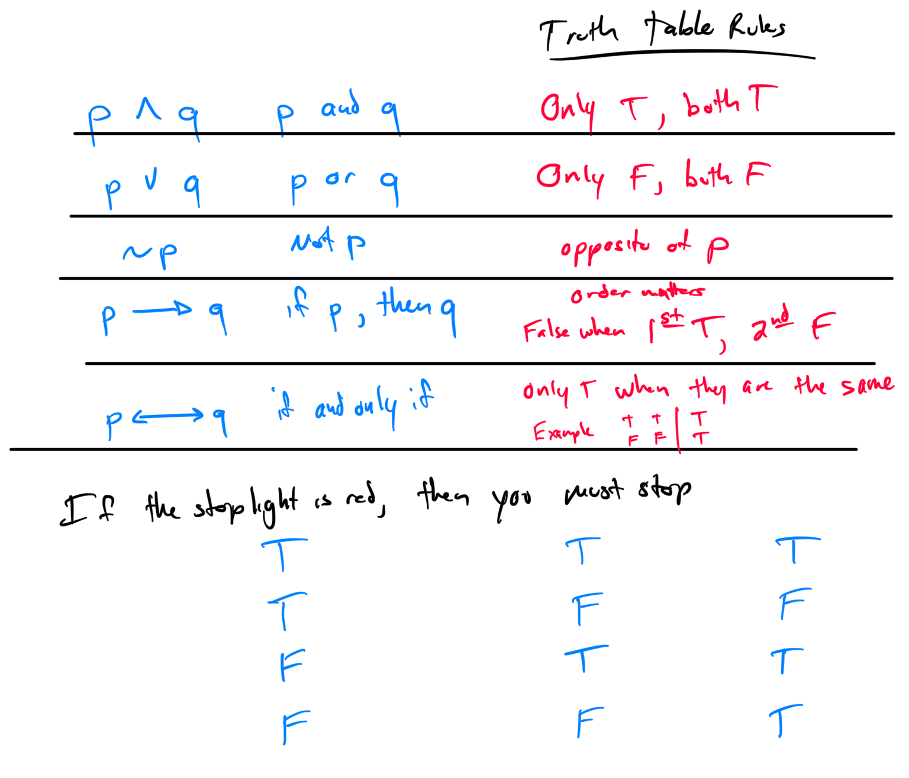
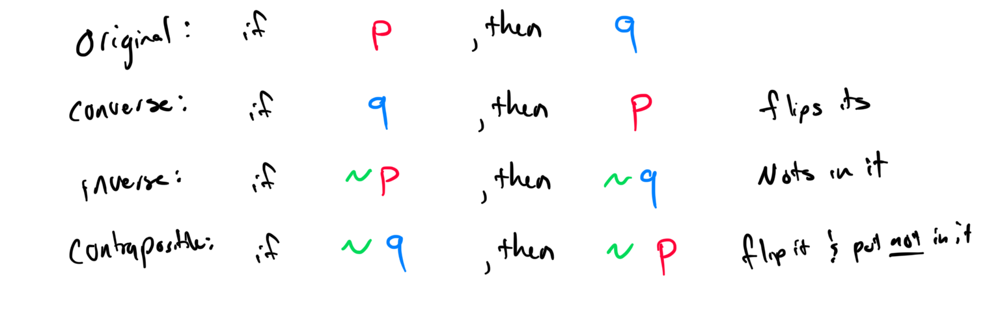
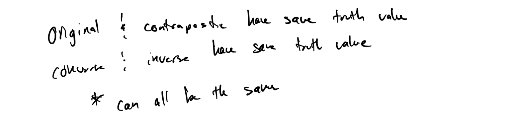

# Week 9 - Conditional Statements

[Video - Part 1](https://youtu.be/wKNYhBd8mSg)
[Video - Part 2](https://youtu.be/71MkmiWokMY)

Topic 1: Symbolic translation involving three statements  

Topic 2: Introduction to truth tables with conditional statements  

Topic 3: Truth tables with conjunctions, disjunctions, and conditional statements  

Topic 4: Using logic to test a claim: Conditional statement, basic  

Topic 5: The converse, inverse, and contrapositive of a conditional statement  

Topic 6: Writing the converse, inverse, and contrapositive of a conditional statement and determining their truth values  

Topic 7: Identifying equivalent statements and negations of a conditional statement  

3rd one is negation. Exactly opposite of original. 

Topic 8: Using logic to test a claim: Conditional statement, advanced

