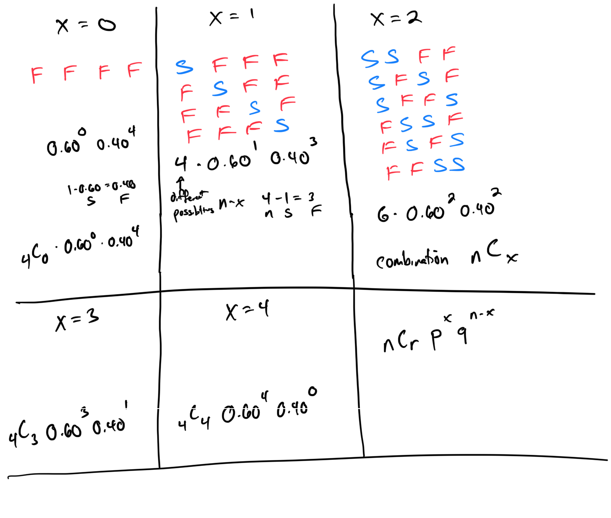

# Module 12 - Binomial

[Video](https://youtu.be/odoAaAsoImk)

### Binomial Definitions:
* Trials = total amount of times you do the experiment.
* Successes = number of times you get the outcome you want.
* Failures = number of times you 
* *do not* get the outcome you want.
* Probability of success = probability of getting what you want.
* Probability of failure = probability of 
* *not* getting what you want.
* n = total number of trials
* x = number of successes
* n-x = number of failures
* p = probability of success
* q (1-p) = probability of failure

### Binomial Experiment Requirements:
1. Set number of trials
2. Clear success and failure.
3. Probability doesn’t change for each trial.
4. Independent 

### Binomial Experiment Example:
Suppose you want to see often planes leave on time.  You read that planes leave on time 60% of the time.  You go to the airport and selected 4 flights at random. What is the probability 0 planes leave on time? 1? 2? 3? 4? 

Topic 1: Binomial problems: Mean and standard deviation

Topic 2: Using the binomial formula to find the probability of exactly m successes

Topic 3: Using the binomial formula to find the probability of more or less than m successes

Topic 4: Binomial problems: Advanced

## Different Binomials Scenarios:

