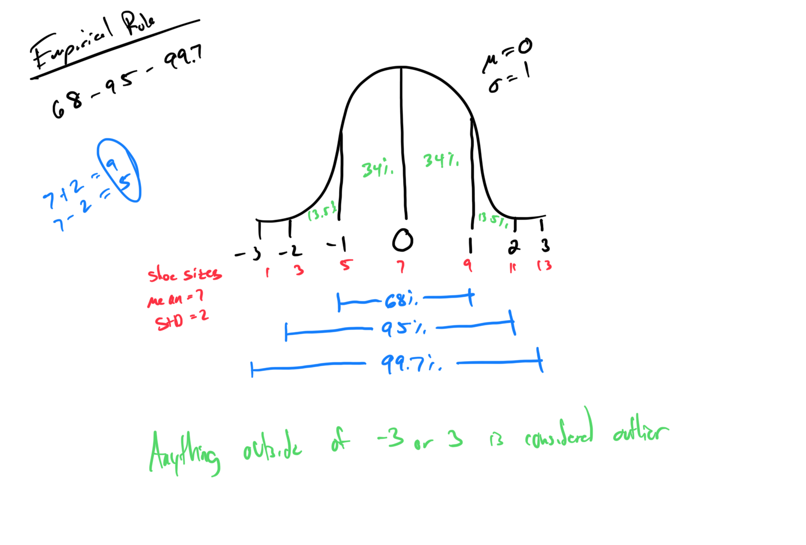
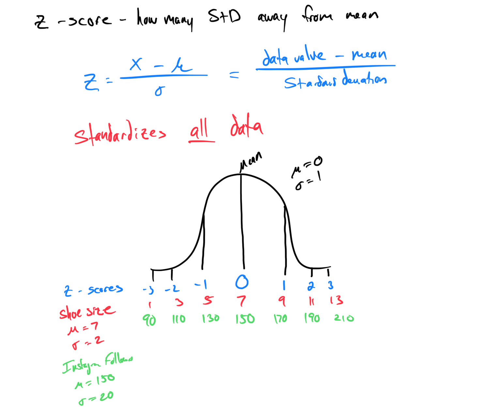

# Module 14 - Empirical Rule and Z-Scores

[Video](https://youtu.be/6l89R83Gy24)

### Topic 1: Using the empirical rule to identify values and percentages of a normal distribution  

### Topic 2: Word problem involving calculations from a normal distribution  

### Topic 3: Finding a z-score for a given data value  

### Topic 4: Finding a z-score and interpreting it in terms of the population mean and standard deviation  

### Topic 5: Comparing the relative sizes of data values based on their z-scores  

 
     You can only compare z-scores when the distribution is bell-shaped!
 

### Topic 6: Shading a region and finding its standard normal probability

