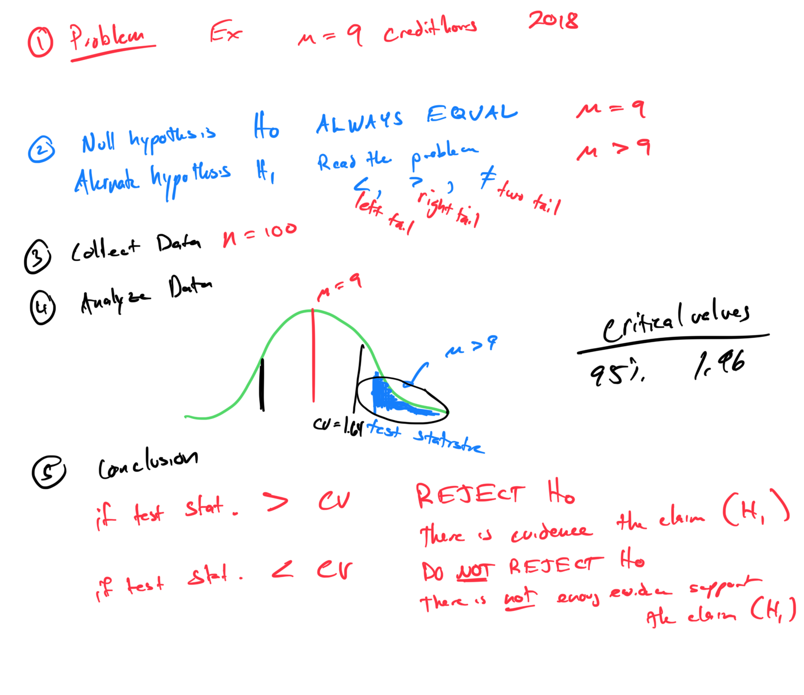

# Module 18 - Hypothesis Testing - Critical Value

[Video](https://youtu.be/qOpN9639TmM)

### - Topic 1: Determining null and alternative hypotheses for a test of a population mean

### - Topic 2: Determining null and alternative hypotheses for a test of a population proportion

### - Topic 3: Introduction to performing a hypothesis test: Critical value method

### - Topic 4: Introduction to hypothesis tests for the population mean using the critical value method: Z test

### - Topic 5: Introduction to hypothesis tests for the population mean using the critical value method: t test

### - Topic 6: Introduction to hypothesis tests for a population proportion using the critical value method

 

