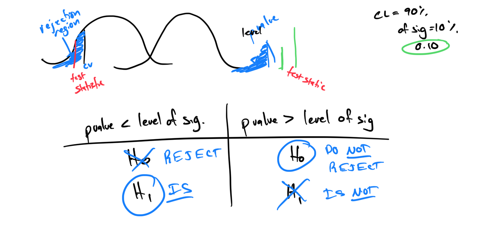

# Module 19 - Hypothesis Testing - p Value

[Video
](https://youtu.be/DA-_X4mnbl0)

### - Topic 1: Introduction to performing a hypothesis test: p value method

### - Topic 2: Introduction to hypothesis tests for the population mean using the p value method: Z test

### - Topic 3: Introduction to hypothesis tests for the population mean using the p value method: t test

### - Topic 4: Introduction to hypothesis tests for a population proportion using the p value method