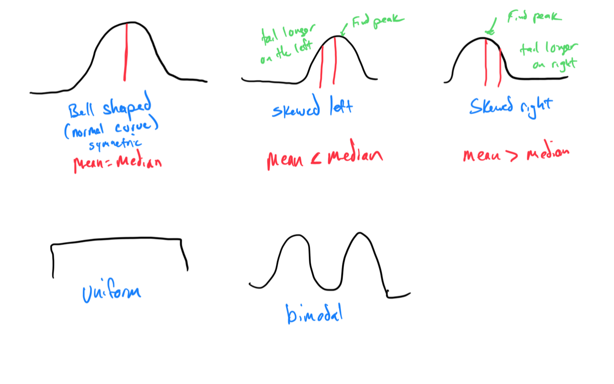

# Module 2 - Interpret Graphical Presentations

[Video](https://youtu.be/mEkfM7rGgc0)

## Definitions:

<u>Frequency</u>: The number of times a value of the data occurs.
<u>Relative Frequency</u>: The ratio of the number of times a value of the data occurs in the set of all outcomes to the number of all outcomes

<u>Histogram</u>:  A graphical representation in x – y form of the distribution of data in a data set; x represents the data and y represents the frequency, or relative frequency. The graph consists of contiguous rectangles.

<u>Class</u>: categories which data is grouped.
<u>Interval</u>: a range of data and is used when displaying large data sets.

## ALEKS Topics:

Topic 1: Interpreting a line graph

Topic 2: Interpreting a tally table

Topic 3: Interpreting a bar graph

Topic 4: Interpreting a double bar graph

Topic 5: Finding a percentage of a total amount in a circle graph

Topic 6: Interpreting relative frequency histograms

Topic 7: Shapes of discrete distributions

Topic 8: Interpreting a stem-and-leaf display

Topic 9: Understanding how adjusting the vertical scale can make a graph misleading

Topic 10: Understanding how two dimensional graphs can be misleading

The answer is 5.  
Because it says “hundred visitors”. “5 hundred visitors”

Topic 11: Constructing a two-way frequency table: Advanced

Topic 12: Interpreting a pictograph table

