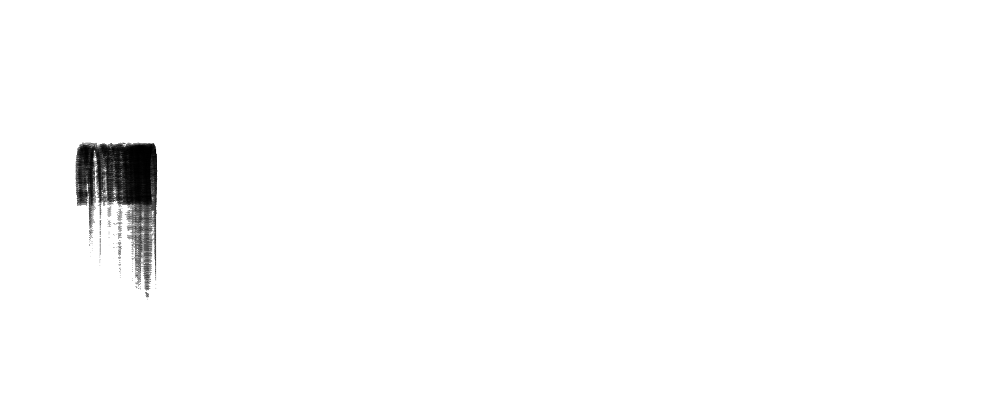

# Module 3 - Constructing Graphical Presentations

[Video](https://youtu.be/wSPjtOnR5HY)

### Topic 1: Constructing a frequency distribution for non-grouped data

### Topic 2: Representing data on a bar graph

### Topic 3: Constructing a frequency distribution and a histogram

Topic 4: Constructing a relative frequency distribution for grouped data

Topic 5: Representing data on a dot plot

Topic 7: Constructing a percent bar graph

