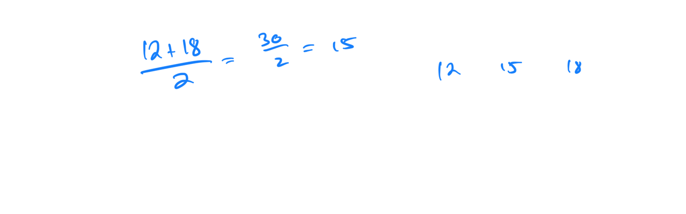
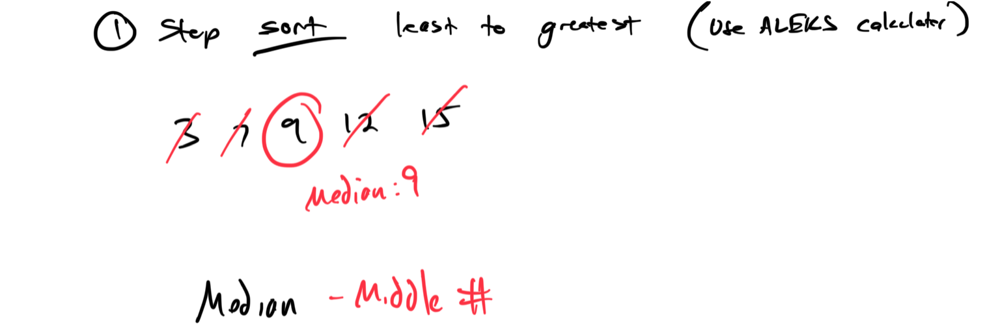
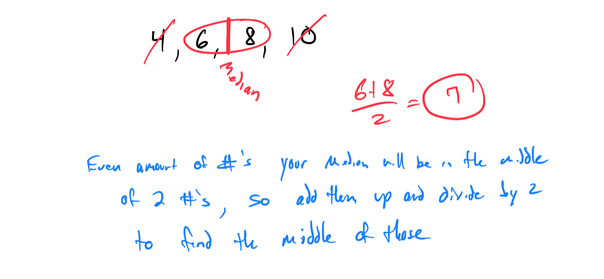
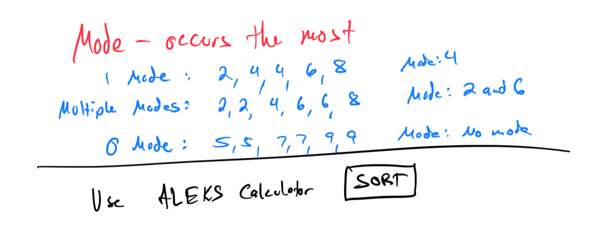
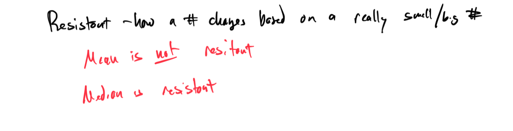
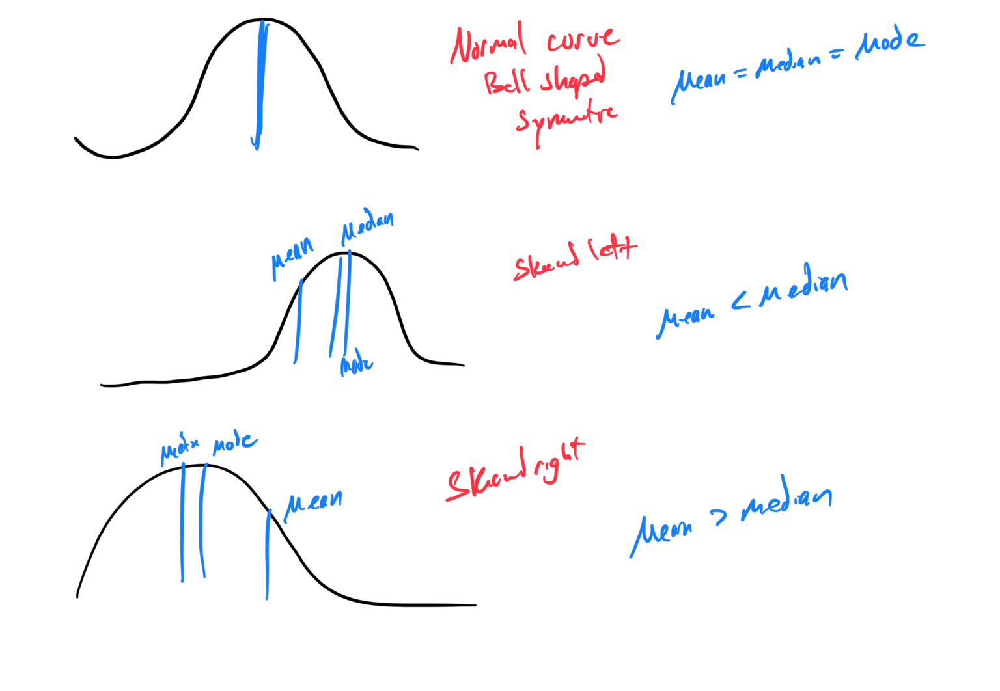

# Module 4 - Measures of Center

[Video](https://youtu.be/c-Zvj0Ywc5A)

Topic 1: Average of two numbers

Problem 1: Find the average of 12 and 18.
Answer: The average is (12 + 18) / 2 = 30 / 2 = 15.

Problem 2: Calculate the average of 25 and 35.
Answer: The average is (25 + 35) / 2 = 60 / 2 = 30.

Topic 2: Introduction to summation notation

Topic 3: Mean of a data set

Problem 1: Find the mean of the data set {4, 8, 12, 16}.
Answer: Mean = (4 + 8 + 12 + 16) / 4 = 40 / 4 = 10.

Problem 2: Calculate the mean of {7, 9, 11, 13, 15}.
Answer: Mean = (7 + 9 + 11 + 13 + 15) / 5 = 55 / 5 = 11.

Topic 4: Computations involving the mean, sample size, and sum of a data set

Topic 5: Finding the value for a new score that will yield a given mean

Topic 6: Rejecting unreasonable claims based on average statistics

Topic 7: Weighted mean: Tabular data

Problem 1: A course has 3 tests (weight 20% each) with scores 80, 85, 90, and a final exam (weight 40%) with score 95. Find the weighted mean.
Answer: Weighted mean = (0.2 × 80) + (0.2 × 85) + (0.2 × 90) + (0.4 × 95) = 16 + 17 + 18 + 38 = 89.

Problem 2: A grade has 2 quizzes (weight 25% each, scores 70, 80) and a project (weight 50%, score 90). Calculate the weighted mean.
Answer: Weighted mean = (0.25 × 70) + (0.25 × 80) + (0.5 × 90) = 17.5 + 20 + 45 = 82.5.

Topic 8: Median of a data set
Problem 1: Find the median of the data set {3, 7, 9, 12, 15}.
Answer: Ordered set: {3, 7, 9, 12, 15}. Median is the middle value, 9.

Problem 2: Calculate the median of {4, 8, 10, 6}.

Topic 9: Mode of a data set

Problem 1: Find the mode of the data set {2, 4, 4, 6, 8}.
Answer: Mode is 4, as it appears most frequently (twice).

Problem 2: Determine the mode of {1, 3, 3, 5, 5, 7}.
Answer: Modes are 3 and 5, as each appears twice (bimodal).

Topic 10: Mean, median, and mode: Computations

Topic 11: How changing a value affects the mean and median

To find mean: Use ALEKS calculator and the summation button and divide by how many there are.
Orignial mean: 527
New mean: 544
544-527 = 17 
Increased by 17

Topic 12: Choosing the best measure to describe data

Topic 13: Comparing the mean, median, and mode of a data set

