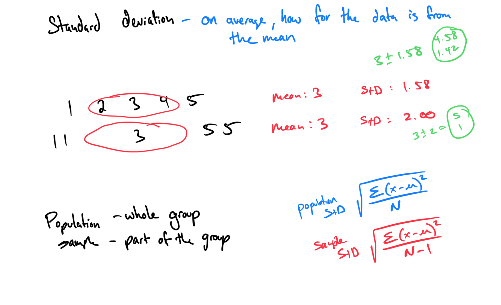
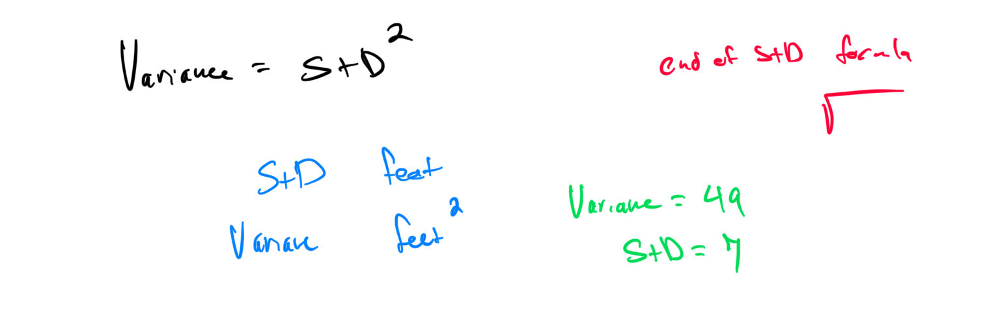

# Module 5 - Measures of Variation

[Video](https://youtu.be/1qrpPoHVLbg)

Topic 1: Range of a data set
Problem 1: Find the range of the data set {3, 7, 9, 12, 15}.
Answer: Range = maximum - minimum = 15 - 3 = 12.

[D2CB10E8-674C-4C30-BD4C-EB40B70ECB6F](attachments/D2CB10E8-674C-4C30-BD4C-EB40B70ECB6F.png)

Problem 2: Calculate the range of the data set {4, 8, 2, 10, 6}.
Answer: Range = maximum - minimum = 10 - 2 = 8.

Topic 2: Comparing measures of center and variation

Topic 3: Using back-to-back stem-and-leaf displays to compare data sets

Topic 4: Population standard deviation
Problem 1: Calculate the population standard deviation for {2, 4, 6, 8}. Use σ = √[Σ(x - μ)² / N].
Answer: Mean μ = (2 + 4 + 6 + 8) / 4 = 20 / 4 = 5. Deviations: (2-5)² = 9, (4-5)² = 1, (6-5)² = 1, (8-5)² = 9. Variance = (9 + 1 + 1 + 9) / 4 = 20 / 4 = 5. σ = √5 ≈ 2.24.

1. Find the mean = 5
2. Fill out the table
	1. Add the last column 9+1+1+9Divide by n 20/4=5
4. Take the square root sqrt(5)  

| X          | X - mean   | (X-mean)^2 |
|------------|------------|------------|
| 2          | -3         | 9          |
| 4          | -1         | 1          |
| 6          | 1          | 1          |
| 8          | 3          | 9          |
|            |            |            |

Topic 5: Sample standard deviation
Same numbers as above. 
1. Find the mean
2. Fill out the table
3. Add the last column
4. Divide by n-1  20/3=6.67
5. Take the square root sqrt(6.67)

Topic 6: Notation for the population mean, sample mean, population standard deviation, and sample standard deviation

Topic 7: Comparing standard deviations without calculation

Topic 8: Identifying the center, spread, and shape of a data set

### Activity:

