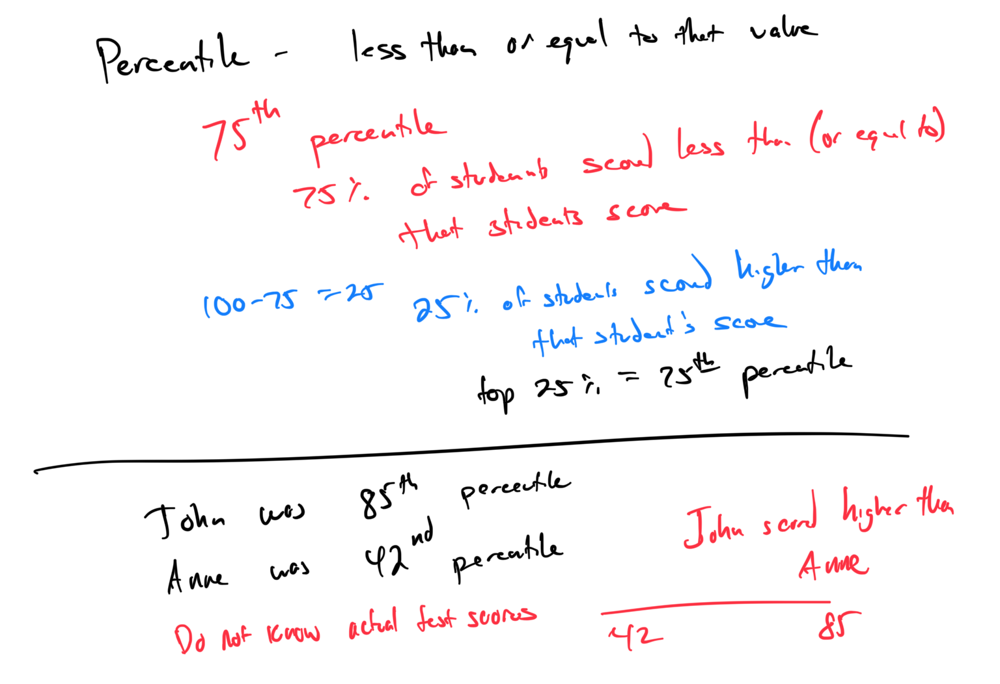
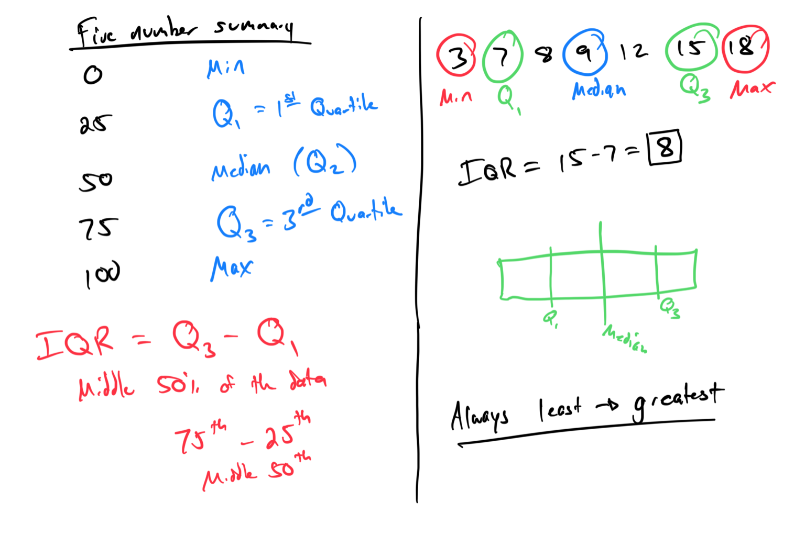
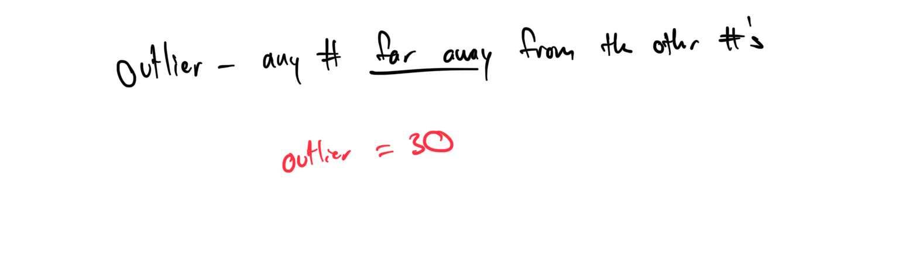
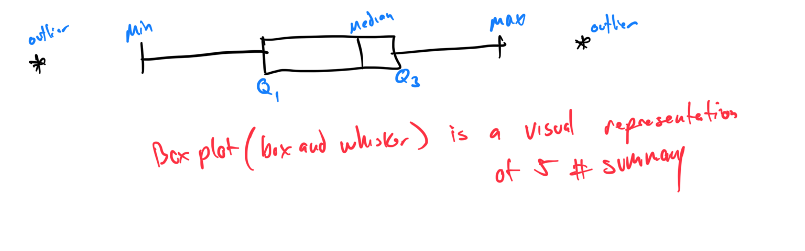
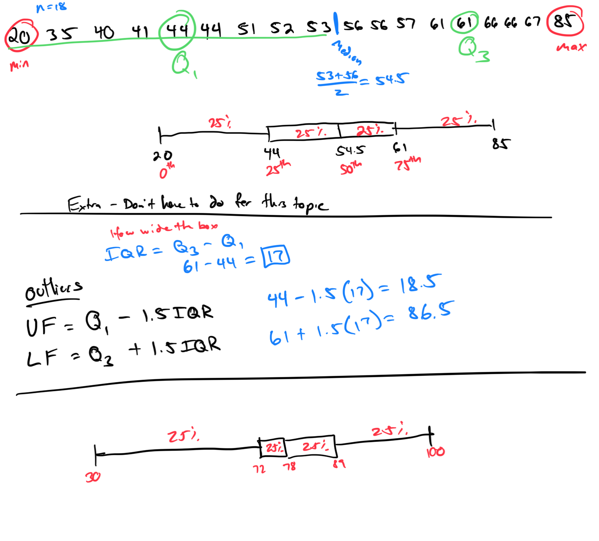

# Module 6 - Measures of Position

[Video](https://youtu.be/k4nYBqzs3M4)

### Topic 1: Percentage of data below a specified value
Problem 1: In a data set {10, 20, 30, 40, 50}, find the percentage of data values below 30.
Answer: Values below 30: {10, 20} (2 values). Total values: 5. Percentage = (2/5) × 100 = 40%.

Problem 2: For the data set {5, 15, 25, 35, 45, 55}, calculate the percentage of data below 40.
Answer: Values below 40: {5, 15, 25, 35} (4 values). Total values: 6. Percentage = (4/6) × 100 ≈ 66.67%.

### Topic 2: Interpreting percentile ranks
Problem 1: A student’s score is in the 75th percentile of a test. Interpret what this means.
Answer: The student’s score is higher than 75% of the scores in the test distribution, meaning it is in the top 25% of scores. 

Problem 2: A runner’s time is in the 90th percentile. Explain the percentile rank.
Answer: The runner’s time is faster than 90% of all runners’ times, placing them in the top 10% of the distribution.

### Topic 3: Five-number summary and interquartile range
Problem 1: For the data set {3, 7, 8, 9, 12, 15, 18}, find the five-number summary and interquartile range (IQR).
Answer: Ordered set: {3, 7, 8, 9, 12, 15, 18}. Five-number summary: Minimum = 3, Q1 = 7, Median = 9, Q3 = 15, Maximum = 18. IQR = Q3 - Q1 = 15 - 7 = 8.

Problem 2: Calculate the five-number summary and IQR for {4, 6, 10, 12, 14, 16, 20, 22}.
Answer: Ordered set: {4, 6, 10, 12, 14, 16, 20, 22}. Minimum = 4, Q1 = (6 + 10)/2 = 8, Median = (12 + 14)/2 = 13, Q3 = (16 + 20)/2 = 18, Maximum = 22. IQR = 18 - 8 = 10.

### Topic 4: Introduction to finding outliers in a data set
Problem 1: Using the data set {3, 7, 8, 9, 12, 15, 30}, determine if there are any outliers.

Problem 2: For {5, 6, 7, 8, 9, 10, 20}, identify any outliers

### Topic 5: Interpreting a box-and-whisker plot

### Topic 6: Constructing a box-and-whisker plot
Problem 1: Construct a box-and-whisker plot for 61, 56, 53, 40, 66, 67, 66, 61, 44, 41, 44, 35, 57, 52, 51, 56, 85, 20

### Topic 7: Using box-and-whisker plots to compare data sets

