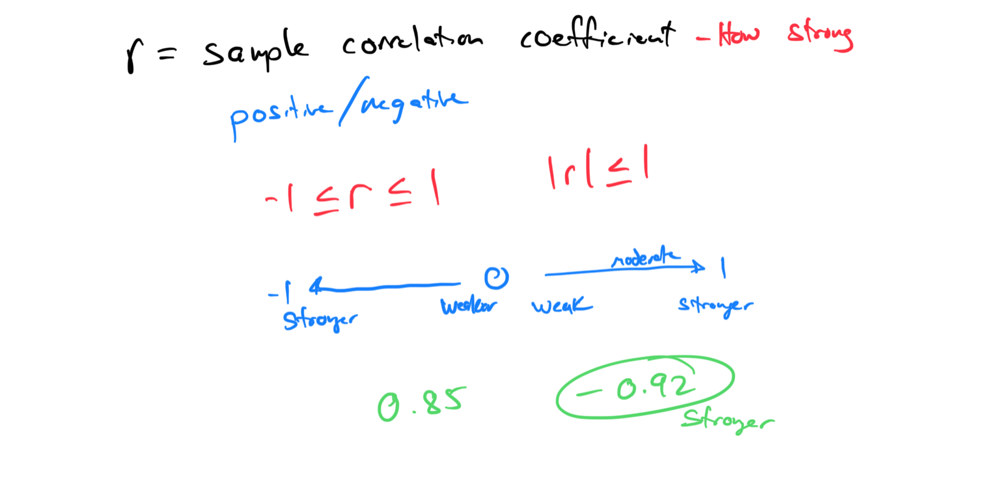

# Module 7 - Linear Correlation and Regression

[Video](https://youtu.be/kqb_E0IZ8IY)

Topic 1: Finding x- and y-intercepts given the graph of a line on a grid

Topic 2: Classifying slopes given graphs of lines

Topic 3: Constructing a scatter plot

Topic 4: Linear relationship and the sample correlation coefficient

Topic 5: Identifying correlation and causation

Topic 6: Sketching the least-squares regression line

Topic 7: Scatter plots and correlation

Topic 8: Interpreting the slope of the least-squares regression line

Topic 9: Interpreting the equation of the least-squares regression line to make predictions

Topic 10: Performing a simple linear regression

Topic 11: Classifying linear and nonlinear relationships from scatter plots

Topic 12: Interpreting the regression coefficients

