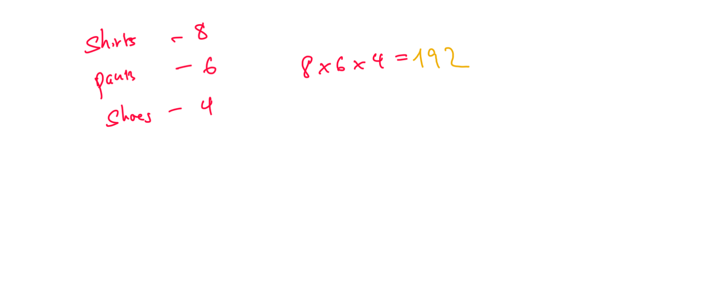
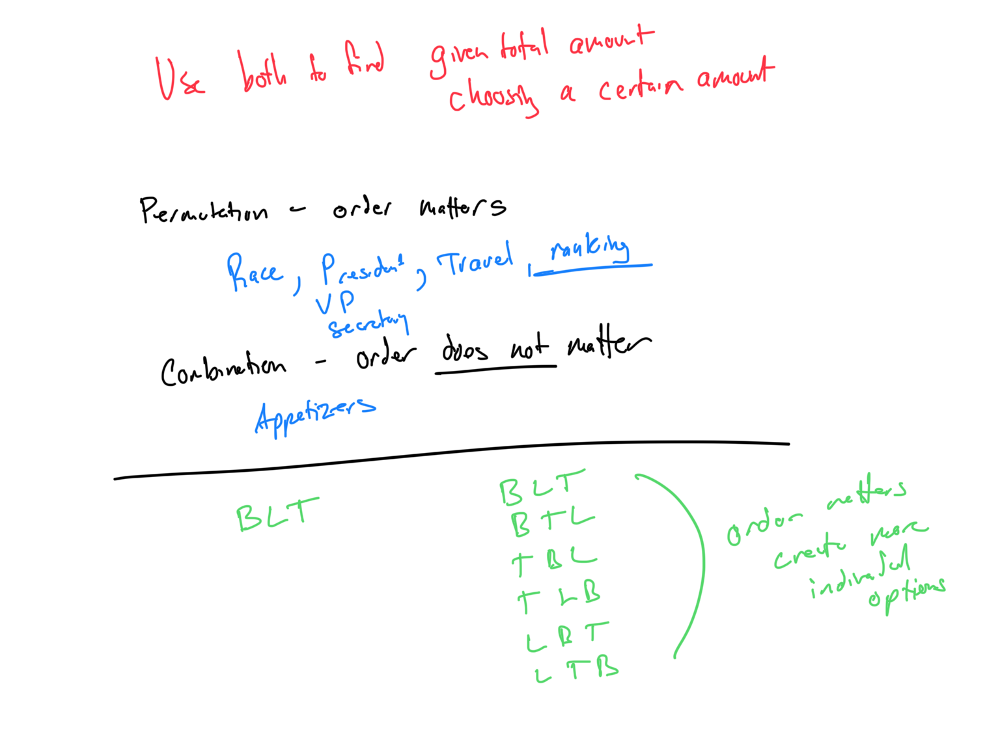

# Module 8 - Combinatorics

[Video](https://youtu.be/A2M8rNm63Fc)

Topic 1: Interpreting a tree diagram

Topic 2: Introduction to the counting principle

Topic 3: Counting principle

Topic 4: Introduction to permutations and combinations

Topic 5: Permutations and combinations: Problem type 1

Topic 6: Permutations and combinations: Problem type 2

