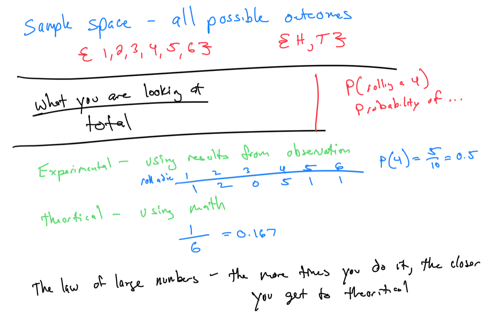

# Module 9 - Probability

I think Part 1 didn’t record :(
[Video - Part 2](https://youtu.be/dIExGRB8WX8)

Topic 1: Union and intersection of finite sets

Topic 2: Determining a sample space and outcomes for an event: Experiment involving a single selection

Topic 3: Introduction to the probability of an event

Topic 4: Probability involving one die or choosing from n distinct objects

Topic 5: Probability involving choosing from objects that are not distinct

Topic 6: Probability of selecting one card from a standard deck

Topic 7: Finding probabilities of events and complements

Topic 8: Experimental and theoretical probability

Topic 9: Outcomes and event probability

Topic 10: Identifying independent events given descriptions of experiments

Topic 11: Calculating relative frequencies in a contingency table

Topic 12: Probabilities of draws with replacement

Topic 13: Finding the odds in favor and against

Topic 14: Probability of independent events involving a standard deck of cards

Topic 15: Probability of dependent events involving a standard deck of cards

