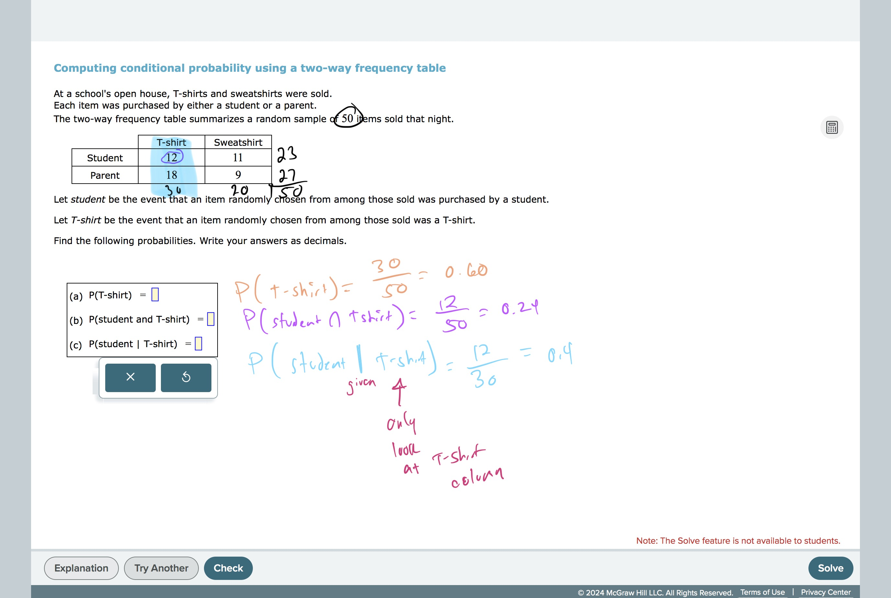
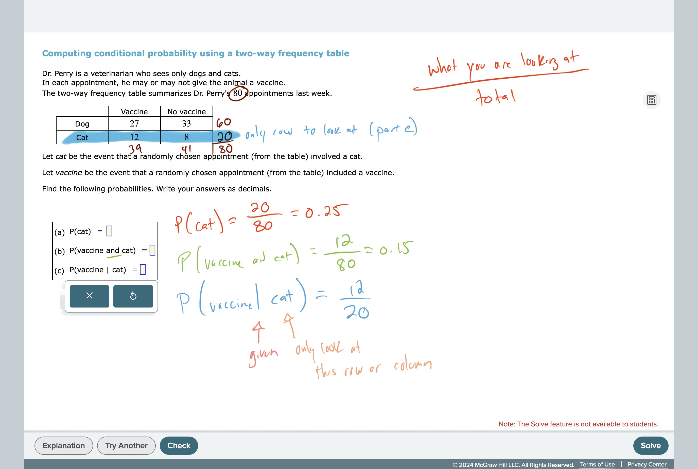
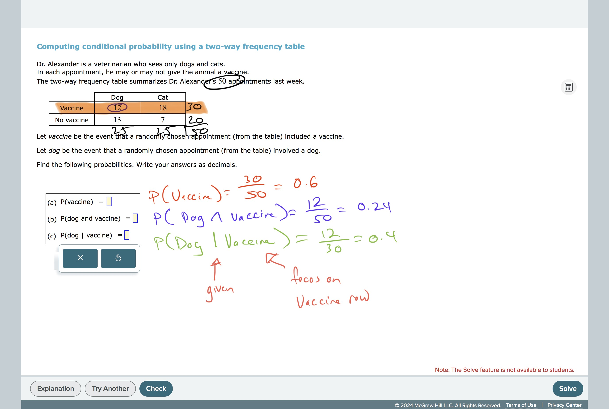
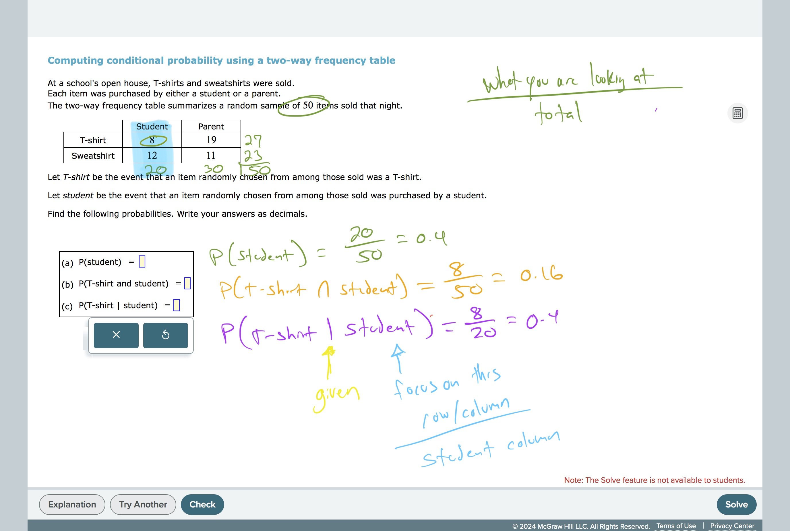

# Computing conditional probability using a two-way frequency table

[
https://youtu.be/Z0KqHemhpmE?si=cZeiNtTDryEcoB0d](https://youtu.be/Z0KqHemhpmE?si=cZeiNtTDryEcoB0d)

#CountingAndProbability 
#Probability 