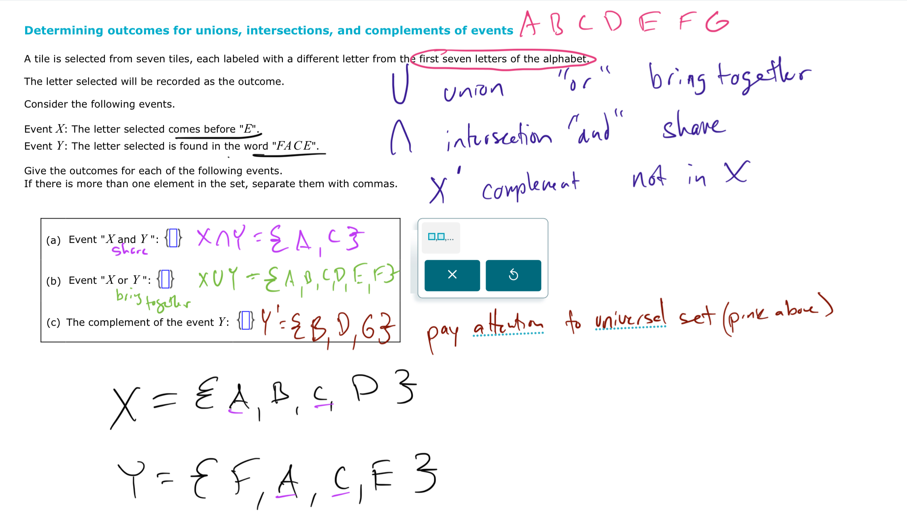
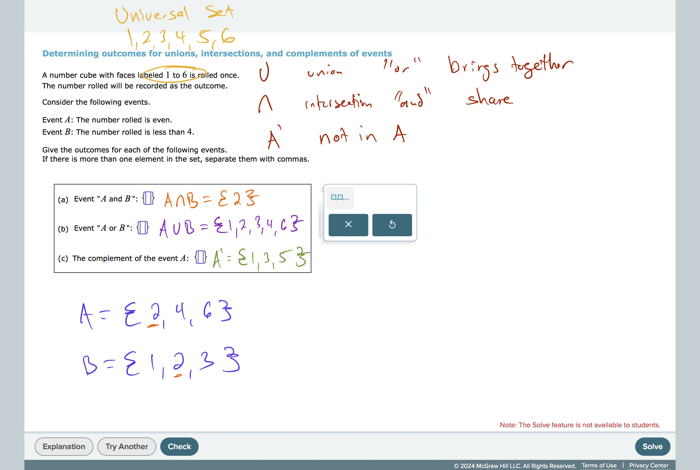

# Determining outcomes for unions, intersections, and complements of…

# **Determining outcomes for unions, intersections, and complements of events**

[
https://youtu.be/5BV6YRjSYZg?si=NZEWqjR5YdVPQAh9](https://youtu.be/5BV6YRjSYZg?si=NZEWqjR5YdVPQAh9)

#CountingAndProbability
#Probability 