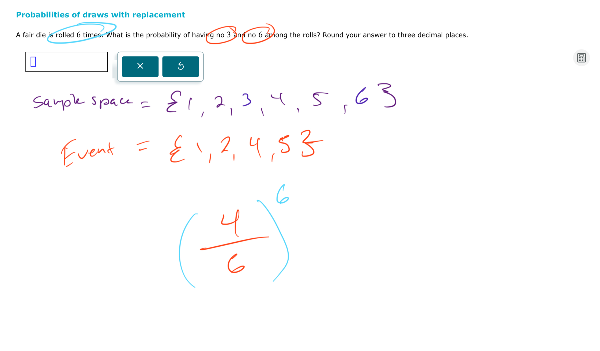
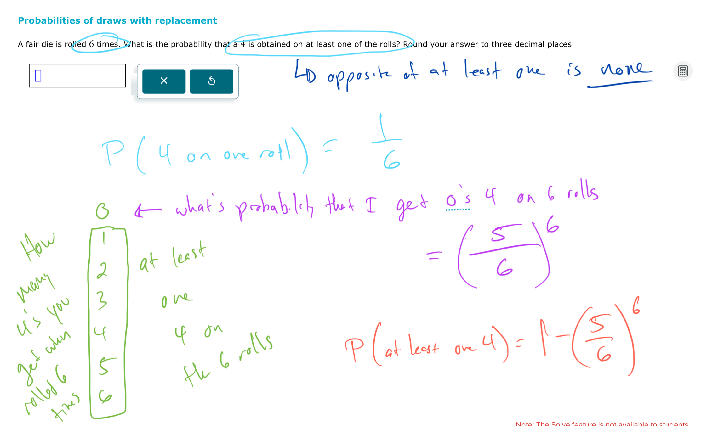
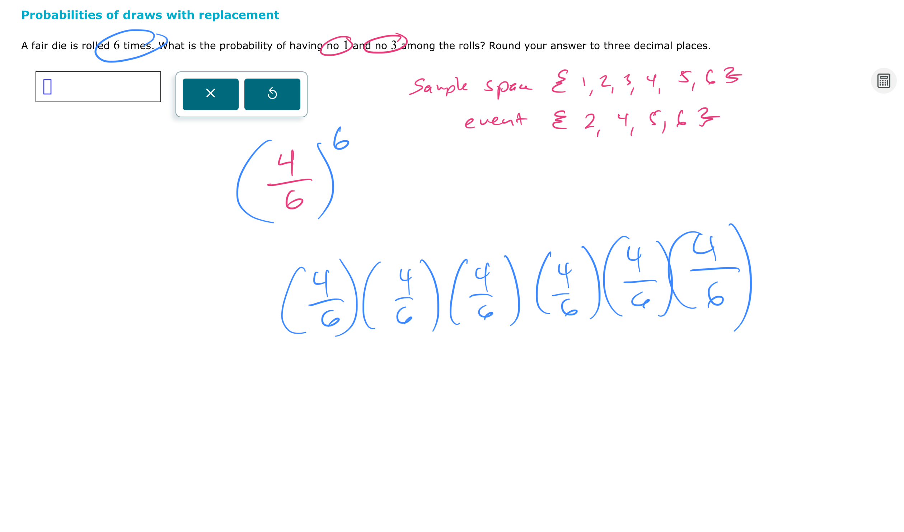
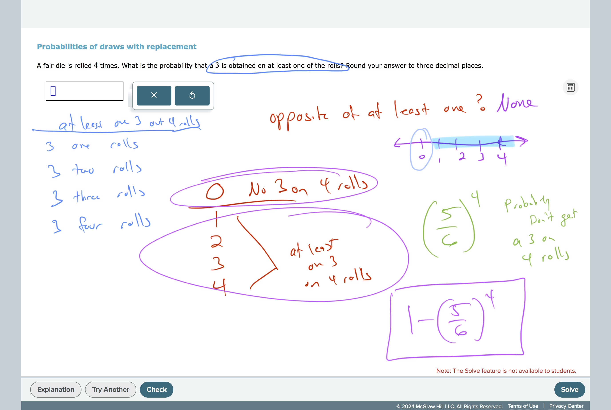
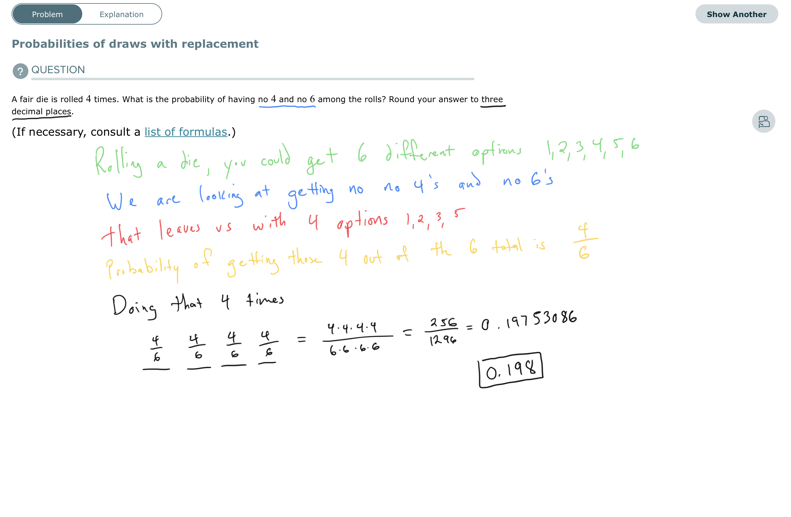

# Probability of draws with replacements

The thought process here is that since the opposite of at least one is none, you need to find out what the probability of NOT getting a 4 is and then take that number from 1 (or 100%).

[https://youtu.be/wiy6tFrvuy4?si=gEwKRNA262pKh_Hu](https://youtu.be/wiy6tFrvuy4?si=gEwKRNA262pKh_Hu)

#CountingAndProbability 
#Probability 

