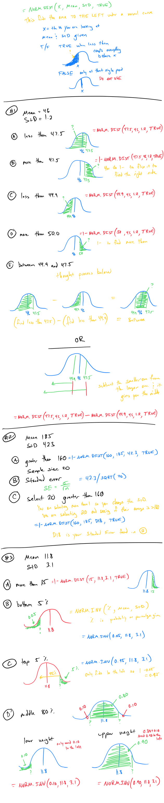
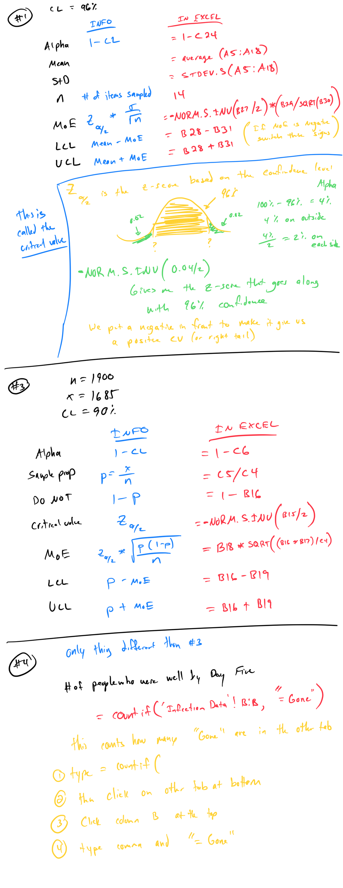
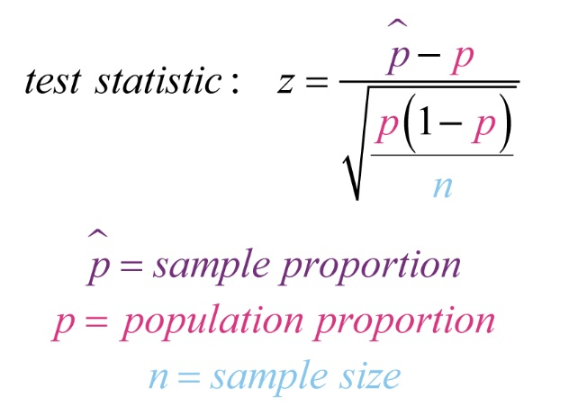
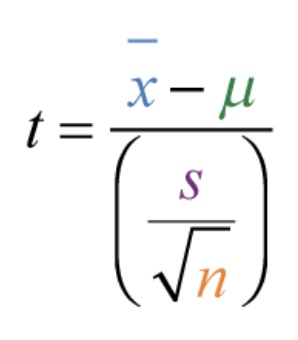

# Stats Integrated Excel Formulas

## Integrated Excel #3
=average(cells)
=median(cells)
=mode.sngl(cells)
=max(cells)
=min(cells)

Quartiles (you need to find first, second, third, or fourth so type 1,2,3, or 4)
=quartile.exc(cells, which quartile)

Percentiles (type in percentile you need. I.e. to find 20th percentile type 0.20)
=percentile(cells, percentile needed)

Interquartile Range (IQR) = Q3 - Q1
Lower Limit Bound = Q1 - 1.5*IQR
Upper Limit Bound = Q3 +1.5*IQR

Midrange:
=(MAX(cells) + MIN(cells)) / 2

Standard deviation (pick sample or population):
=stdev.s(cells) 
=stdev.p(cells)
=range(cells)
### 
Question #4
Z-Score (autofill)

Stats Formula: 

Excel Formula:
=(B17-$C$12)/$C$13

-You then can use auto fill and drag down (little box in the bottom left hand corner when you click on the cell)
-The $ lock that cell in place.  Now the mean and standard deviation do not change when you drag it down.

## Integrated Excel #4

Permutations and Combination:
=PERMUT(cells)
=COMBIN(cells)

## Integrated Excel #5

Binomial:
=binomial.dist(# of success, # of trials, probability of success as decimal, FALSE)

=binomial.dist.range(# of trials, probability of success, lower range #, higher range number  # )

The numbers for my problem #1: 
Probability of success: 39%
Number of trials: 5

## Integrated Excel #6
=correl(highlight one column, highlight the other column)

## 

Integrated Excel #7

## Integrated Excel #8

## 
Integrated Excel #9

#1
Row 9: Null is always =
Row 10: Alternative you have to read the problem, should be < or > or =/=

Row 15-27 is probably always going to be yes on all of them because if there is a no you can’t do the problem

Row 34-37:
Critical Value:
	If < 			=NORM.S.INV(B4)		
	If > 			=-NORM.S.INV(B4)		
	If =/=			=-NORM.S.INV(B4/2)

Sample Proportion (p-hat): G4/B5

Test Statistic: 		=(B35-G5)/SQRT((G5*(1-G5))/B5)

P-Value:
	If < 			= NORM.S.DIST(B36,TRUE)				Gives you to the left
	If > 			=1-NORM.S.DIST(B36,TRUE)			Gives you to the right
	If =/=			=2*NORM.S.DIST(B36,TRUE)			Gives you to the left then times 2 because it’s 2 tail

#2

Row 12: Null is always =
Row 13: Alternative you have to read the problem, should be < or > or =/=

Row 15: < or > is one tail, =/= is two tail

 
Row 21: =(B5-B7)/(F5/SQRT(B6))

Row 30:
	Smaller Critical Value: =NORM.S.INV(F6/2)
	Larger Critical Value:  =-NORM.S.INV(F6/2) (or =-C30)

